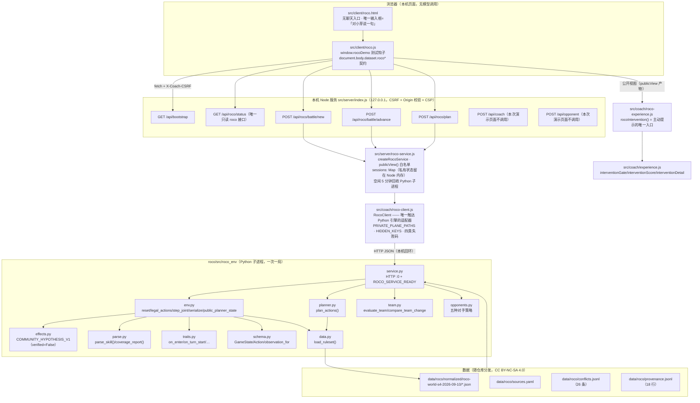

# F03 · MVP 架构图（手游规则引擎 + 无聊天入口教练）

> 本文只描述**今天代码里真实存在的分层**。每一条结论都标了「证据」= 我实际读过或跑过的文件 / 命令。
> 数据与规则事实全部来自 `roco/src/roco_env/**`（Python）与 `data/roco/normalized/**`；
> Node 侧没有任何一处自己实现数值或机制。

**证据（本篇通读的文件）**：`src/client/roco.html`、`src/client/roco.js`、`src/server/index.js`、
`src/server/roco-service.js`、`src/coach/roco-client.js`、`src/coach/roco-experience.js`、
`src/coach/experience.js`、`roco/src/roco_env/{service,env,effects,planner,data,parse,traits,team,opponents,schema}.py`、
`data/roco/sources.yaml`；命令：`PYTHONPATH=src python3 -m roco_env.parse`、
`npm run test:roco-all`（exit 0）、`npm run test:roco`（15/15 通过）。

---

## 1. 全景图（Mermaid，纯文本，无需构建）



### 1.1 等价的 ASCII 分层（便于纯文本阅读）

```text
┌──────────────────────────────────────────────────────────────────────────────┐
│ 浏览器  src/client/roco.html + roco.js                                       │
│  · 没有聊天入口：唯一输入框是 #say-input「对小芽说一句」→ 陪练情绪层          │
│  · 测试钩子 window.rocoDemo = {state,startBattle,playAction,autoTurn,         │
│                               requestPlan,say,refreshHint,render}            │
│  · dataset 契约：data-roco-ready / -view / -status / -hint / -action /       │
│                  -gate / -hint-version / -lesson / -companion(-why|-seen)    │
└───────────────▲──────────────────────────────────────────────────────────────┘
                │ fetch（仅这五条；不调用 /api/coach、不调用 /api/opponent）
┌───────────────┴──────────────────────────────────────────────────────────────┐
│ Node 服务  src/server/index.js（createCoachServer）                          │
│  GET  /api/bootstrap      会话 + CSRF + nonce + SPKI 公钥                     │
│  GET  /api/roco/status    只读；不改状态、不需要 CSRF                         │
│  POST /api/roco/battle/new│advance│plan                                      │
│  POST /api/coach  /api/opponent   （存在，但演示页不调用 → 演示不需要 API key）│
└───────────────▲──────────────────────────────────────────────────────────────┘
                │ rocoService.startBattle / advanceBattle / planBattle
┌───────────────┴──────────────────────────────────────────────────────────────┐
│ src/server/roco-service.js                                                   │
│  · 私有对局状态留在 Node 内存：sessions: Map<sessionId,{state,strategy,seed}> │
│  · 出门一律过 publicView() 白名单                                            │
│  · ANALYSIS_SEEDS=[11,29,47] 固定；DEMO_SEED=20260921 只走对局域             │
└───────────────▲──────────────────────────────────────────────────────────────┘
                │ RocoClient（child_process + node:http）
┌───────────────┴──────────────────────────────────────────────────────────────┐
│ src/coach/roco-client.js —— 唯一适配器                                       │
│  教练域：POST /rules/query /team/* /battle/plan   只发公开面，永远扫描隐藏键  │
│  对局域：POST /battle/new|legal|advance           PRIVATE_PLANE_PATHS，按设计带私有状态 │
└───────────────▲──────────────────────────────────────────────────────────────┘
                │
┌───────────────┴──────────────────────────────────────────────────────────────┐
│ roco/src/roco_env/**（Python）  service / env / effects / planner / data /   │
│ parse / traits / team / opponents / schema                                   │
└───────────────▲──────────────────────────────────────────────────────────────┘
                │ load_ruleset()
┌───────────────┴──────────────────────────────────────────────────────────────┐
│ data/roco/normalized/roco-world-s4-2026-09-10/*.json + sources.yaml +        │
│ conflicts.jsonl + provenance.jsonl                                           │
└──────────────────────────────────────────────────────────────────────────────┘
```

---

## 2. 每一层的真实职责与关键函数

### 2.1 浏览器演示页 `src/client/roco.html` + `src/client/roco.js`

| 事实 | 证据 |
|---|---|
| 页面标题就是「小芽 · 手游规则演示（无聊天入口）」 | `roco.html:1` |
| 页面上只有**一个**输入框：`#say-input`，placeholder「想说点什么（例如「好烦，又输了」）」，按钮「说一句」 | `roco.html:53-56` |
| 它走的是陪练，不是战术问答：`say()` 调 `intentOf` / `decideRegister` / `chatReply`，并写 `data-roco-companion` | `roco.js:333-358` |
| 测试钩子：`window.rocoDemo = {state, startBattle, playAction, autoTurn, requestPlan, say, refreshHint, render}` | `roco.js:420` |
| dataset 契约（验收脚本用，不用中文按钮文案） | `roco.js:110,145,151,156,198-199,216-217,323,354-356,416` |
| 页面自报「这次演示覆盖了什么」六条 | `roco.js:361-368`（`COVERAGE`） |
| 只调用 `/api/bootstrap`、`/api/roco/status`、`/api/roco/battle/new`、`/api/roco/battle/advance`、`/api/roco/plan` | `roco.js:49,245,262,279,290,409` |

### 2.2 Node HTTP 端点 `src/server/index.js`

| 方法 + 路径 | 处理器 | 证据 |
|---|---|---|
| `GET /api/bootstrap` | 建/取会话（cookie `coach_session`）、下发 `csrf` / `nonce` / `publicKey` | `index.js:149-155` |
| `GET /api/roco/status` | 唯一只读 roco 接口，直接 `rocoService.status()` | `index.js:159` |
| `POST /api/roco/battle/new` | `rocoService.startBattle(b)` | `index.js:225` |
| `POST /api/roco/battle/advance` | `rocoService.advanceBattle(b)` | `index.js:226` |
| `POST /api/roco/plan` | `rocoService.planBattle(b)` | `index.js:227` |
| `POST /api/coach` | `runCoach(...)`，会打 DeepSeek | `index.js:180-200` |
| `POST /api/opponent` | `decideOpponentAction(...)`；无密钥时返回 `source:'unconfigured'` | `index.js:201-212,205` |

边界（都在同一函数里，不是文档约定）：Host 必须是 `127.0.0.1:<port>` 或 `localhost:<port>`（`index.js:144-145`）；
Origin 必须同源、`/api/` 一律 POST + `X-Coach-CSRF`（`index.js:161-163`）；CSP `default-src 'self'`（`index.js:142`）。

### 2.3 `src/server/roco-service.js`（Python 子进程生命周期 + 会话表 + 公开面白名单）

| 机制 | 实现 | 证据 |
|---|---|---|
| Python 子进程按需起、空闲回收 | `ensure()` / `stop()` / `IDLE_STOP_MS = 5*60*1000` | `roco-service.js:25,115-142` |
| 私有对局状态留在 Node 内存 | `const sessions = new Map()`，key 是 `s<N>-<rand>` | `roco-service.js:101,149-152,196` |
| 出门一律裁剪 | `publicView(result)` 白名单：self 面板 / 对手**场上** / 合法动作 / 事件 / 结果；`state`、真实 seed、对手后备明细**从不被复制出来** | `roco-service.js:50-89` |
| 教练域只用公开面 | `planBattle()` 先 `client.battleLegal()`，取回执里的 `public`（服务端每次重算 `public_planner_state`），**不接受调用方传 state** | `roco-service.js:229-249` |
| 教练域固定分析种子 | `ANALYSIS_SEEDS = Object.freeze([11,29,47])`，`analysisSeeds:[...ANALYSIS_SEEDS]` | `roco-service.js:27,248` |
| 对局域固定对局种子 | `DEMO_SEED = 20260921`，只在 Node↔Python 之间，不进浏览器、不进教练请求 | `roco-service.js:33-40,190` |
| 关服务带走子进程 | `server.on('close', … rocoService.stop())` | `index.js:248-251` |

### 2.4 `src/coach/roco-client.js`（**唯一**触达 Python 引擎的适配器）

- 起服务：`startService()` → `spawn(pythonBin, ['-m','roco_env.service','--host',…,'--ruleset',…,'--parent-pid',…])`，等 `ROCO_SERVICE_READY {json}` 行（`roco-client.js:327-445`）。
- 钉住规则集：`RULESET_ID = 'roco-world-s4-2026-09-10'`、`PROTOCOL_VERSION = 1`（`roco-client.js:44-46`）。
- 四类可区分失败：`ROCO_FAILURE_CLASS = {service, ruleset, version, unsupported, request, protocol}`（`roco-client.js:64-85`）。
- **教练域**方法：`query()/pet()/skill()/learnset()/term()/typeMultiplier()/resolveEffect()`、`planActions(publicState, …)`、`evaluateTeam()`、`compareTeamChange()`（`roco-client.js:769-866`）。
- **对局域**方法：`battleNew()` / `battleLegal()` / `battleAdvance()`（`roco-client.js:879-905`）。
- 隐藏信息两层拦：出口 `findHiddenKeys(payload)`，入口 `findHiddenKeys(envelope)`，泄漏时**连内容都不透传**（`roco-client.js:539-549,617-636`）。
- fail closed：`resolveEffect()` 稳定返回 `unsupported_effect`（`roco-client.js:827-829`）；`summarizeBattle()` 直接给结构化 `not_implemented`，不假装能算（`roco-client.js:911-930`）。

### 2.5 `src/coach/roco-experience.js`（公开视图 → `experience.js` 的投影；主动提示的唯一入口）

| 函数 | 作用 | 证据 |
|---|---|---|
| `rocoPlayable(view)` | 判断这份公开视图还能不能玩（`phase` 为 `battle`/`replace` 且无 `battle_result`） | `roco-experience.js:24-26` |
| `rocoGameView(view,{matchId})` | 把 `max_hp`/`self`/`battle_result` 投成 `experience.js` 认识的 `maxHp`/`player`/`result`；**对手后备不补血量**（补了就是编造隐藏信息） | `roco-experience.js:49-82` |
| `rocoPlanFeatures(plan)` | `gap = expected.max - expected.min`；`recommendation_stable===false` 时 `skill=0` | `roco-experience.js:93-102` |
| `rocoHintStale(hint, version)` | 「状态变化撤销旧建议」的**唯一**入口：`hint.stateVersion !== version` 即作废 | `roco-experience.js:110-113` |
| `rocoLessonEntry({events,turns})` | 局末只挑**一个**决策点；没有亮点返回 `null` | `roco-experience.js:142-156` |
| `rocoIntervention({view,session,plan,host,now})` | **主动提示的唯一入口**：装配特征后交给 `experience.js` 的 `interventionFeaturesOfGame` + `interventionDetail`，页面三处判定都走它 | `roco-experience.js:170-187` |
| `rocoHintText` / `rocoInterventionText` | 措辞纪律：不说胜率、不说「最优」，区间叫「跨分析种子的期望区间」 | `roco-experience.js:123-134,197-205` |
| 门控与评分本体 | `interventionGate()`（硬门控优先）/ `interventionScore()`（四档动作） | `experience.js:151-170,200-223` |

### 2.6 Python 规则引擎 `roco/src/roco_env/*.py`

| 文件 | 关键函数 / 常量 | 证据 |
|---|---|---|
| `data.py` | `load_ruleset()`、`Ruleset.snapshot_fingerprint()`、`TypeChart.multiplier()`、`PANEL_FORMULAS`、`panel_stats()` | `data.py:114-131,160-183,249-254,276-388` |
| `schema.py` | `GameState` / `PetState` / `SideState` / `Action`、`observation_for()`、`charge` 字段 | `schema.py:92,113,292` |
| `effects.py` | `COMMUNITY_HYPOTHESIS_V1`（`verified=False`）、`effective_power()`、`ability_level()`、`status_tick()`、`parse_defense_reduction()`、`respond_to()`、`defense_cooldown_applies()` | `effects.py:86-99,139-205,247-331` |
| `env.py` | `reset()`、`legal_actions()`、`order_actions()`、`step_joint()`、`step_replace()`、`serialize()`、`replay()`、`public_planner_state()`、`observe()`、`_execute()`、`_end_of_turn()` | `env.py:84,149,288,336,766,803,817,862,1041` |
| `parse.py` | `parse_skill()`、`coverage_report(skill_ids, rs)` | `parse.py:93,172` |
| `planner.py` | `plan_actions(state, rs, *, side, depth, beam, budget_ms, clock)`、`evaluate()`、`opponent_distribution()` | `planner.py:96,138,226` |
| `opponents.py` | 五种策略注册 `get_strategy()`、`play_match()`、`wrap_observation()` | `opponents.py:247,789,919` |
| `traits.py` | `TRAITS`（FULL/PARTIAL/REFUSED）、`on_enter()`、`on_turn_start()`、`after_status_skill()`、`after_freeze_applied()` | `traits.py:41-107,124-220` |
| `team.py` | `evaluate_team()`、`compare_team_change()`（**明确不输出胜率**） | `team.py:248,299` |
| `service.py` | `ROUTES = ("/health","/rules/query","/team/evaluate","/team/compare","/battle/plan","/battle/new","/battle/legal","/battle/advance")`、`HIDDEN_KEYS`、`PROTOCOL_VERSION` | `service.py:10-31,1728-1729` |

### 2.7 数据层

| 文件 | 内容 | 证据 |
|---|---|---|
| `data/roco/normalized/roco-world-s4-2026-09-10/pets.json` | `pet_count = 12` | 实读 |
| `…/skills.json` | `counts = {total:824, with_static_power:358, without_static_power:466, traits:245}` | 实读 |
| `…/learnsets.json` | `learnset_count = 12` | 实读 |
| `…/types.json` | `counts = {total:120}` | 实读 |
| `…/terms.json` | `counts = {total:54}` | 实读 |
| `…/history.json` | `versions` 9 个、`pets_with_history = 620` | 实读 |
| `…/support-matrix.json` | `generated_from` 指向 pets/learnsets/skills/types/history | 实读 |
| `data/roco/sources.yaml` | 4 条来源台账（3 个仓库 + S4Season.lua） | 实读 |
| `data/roco/conflicts.jsonl` | 26 行 | `wc -l` |
| `data/roco/provenance.jsonl` | 18 行 | `wc -l` |

---

## 3. 两个信任域，以及私有域为什么必须存在

### 3.1 定义（来自代码，不是文档约定）

`src/coach/roco-client.js:199-213` 逐条列出**对局域网关路径**：

```js
const PRIVATE_PLANE_PATHS = new Set(['/battle/new', '/battle/legal', '/battle/advance']);
```

| | **教练域（coach plane）** | **本地对局域（local-sim plane）** |
|---|---|---|
| 路径 | `/health`、`/rules/query`、`/team/evaluate`、`/team/compare`、`/battle/plan` | `/battle/new`、`/battle/legal`、`/battle/advance` |
| 允许携带的数据 | **只有公开面**：`env.public_planner_state()` 的产物 | 完整私有 `env.serialize()`，**含真实对局 seed** |
| 隐藏键扫描 | **永远开启**（请求侧与回执侧都扫） | 按路径豁免（否则连开一局都做不到） |
| 回执去向 | 可以继续往上层/模型走 | **不得返回浏览器**；由 `publicView()` 裁剪后才出去 |
| 随机性 | `analysis_seeds = [11,29,47]`，与真实对局 seed 无关 | 真实 seed（`DEMO_SEED=20260921`） |

证据：`roco-client.js:199-213,539-550,617-636`；`roco-service.js:5-20,27,40,50-89,229-249`；
`tests/evals/roco/plan-e2e.test.js` 的「两个信任域互不串门：私有端点按路径白名单，教练端点永远扫描」
与「对局域的回执带私有状态：桥按路径收下，公开视图只吐白名单字段」（`npm run test:roco-all` 中 8/8 通过）。

### 3.2 私有域为什么存在（三条原因，都能在代码里指到）

1. **浏览器起不了 Python 子进程。** 所以由 Node 托管**一个**长期存活的 Python 服务，浏览器只跟 Node 说话
   （`roco-service.js:1-9`；`roco-client.js:327-358`）。规则引擎在 Python，这一层无法省略。
2. **一局的状态必须存在某处，而它不能存在浏览器里。** `env.step_joint()` 需要完整 `GameState`（对手后备血量、
   配能、配招、`_pending_*`、真实 seed）才能推进（`env.py:336,803`）。如果把它交给浏览器保管，
   MC-013 的边界立刻失守——真实 seed 能预测同速裁决与后续伤害的随机结果。
   因此状态留在 Node 的 `sessions` Map 里，每局一个 session id（`roco-service.js:101,196`），
   而浏览器拿到的每一份数据都过 `publicView()`（`roco-service.js:50-89`）。
3. **教练的输入必须与对局状态物理隔离。** `planBattle()` **不接受**调用方传 state：
   它重新问一次 `/battle/legal`，拿服务端每次重算出来的公开面（`roco-service.js:236-243`）。
   这样浏览器没有任何机会把私有状态塞进教练请求——这是 MC-013 在本仓库的落点
   （`docs/roco/MICROCASE-PLAN.md` MC-013）。

### 3.3 边界是「按名单」而不是「按名字猜」

桥里两条白名单都不是模式匹配：`PRIVATE_PLANE_PATHS` 逐条列出路径；
`HIDDEN_KEYS` 逐条列出键并做归一化比较（`roco-client.js:111-135`）。
Python 侧 `service.HIDDEN_KEYS`、Node 侧 `roco-client.HIDDEN_KEYS`、浏览器工具层
`toolbox.ROCO_HIDDEN_KEYS` 三份词表由 `tests/evals/roco/plan-e2e.test.js` 的
「三份隐藏信息词汇表必须一一对应」直接读源文件比对——单边改动会变红。

---

## 4. 一次演示请求的真实往返（按代码顺序）

```text
① 浏览器点「开一局」
   roco.js:234 startBattle() → api('/api/roco/battle/new',{strategy:'greedy_damage'})
② Node：会话 + CSRF 校验（index.js:162-163）→ rocoService.startBattle(body)
③ roco-service：ensure() 起 Python（若未起）→ client.battleNew({team,seed:DEMO_SEED,strategy,stateVersion:0})
④ roco-client：_request('POST','/battle/new', payload)
   —— 该路径在 PRIVATE_PLANE_PATHS 内，**跳过**请求侧隐藏键扫描
⑤ Python service.py：/battle/new → env.reset() → 回执含私有 state + public_planner_state
⑥ roco-client：_normalize() 拆信封；该路径同样跳过回执侧扫描（私有域回执按设计带私有状态）
⑦ roco-service：sessions.set(id,{state,strategy,seed,turn})；返回 {ok,battle_id,view:publicView(result)}
⑧ 浏览器：state.view = data.view（只有公开字段）→ render()
```

教练侧走的是另一条：

```text
roco.js:286 requestPlan() → api('/api/roco/plan',{battle_id,depth:2,beam:4})
  → roco-service.planBattle() → client.battleLegal()（拿服务端重算的 public）
  → client.planActions(pub,{stateVersion,depth,beam,analysisSeeds:[11,29,47]})
  → Python /battle/plan（planner.plan_actions，只吃公开 state）
```

要点：教练请求里**没有**本局真实 seed（`roco-service.js:229-249`），所以「同一公开观察 + 不同真实 seed →
结论一致」这条性质在真实链路上成立，并由 `tests/evals/roco/plan-e2e.test.js` 的反证用例钉住。

---

## 5. 这份架构**不**声称什么

- 不声称与官方一致。所有数据来自社区归档，固定 revision 的 Lua 镜像（`data/roco/sources.yaml` 的 `ruleset.caveat`）。
- 不声称机制已核验。`skills.json` 里 824 条技能的 `effect_support` **全部**是 `unsupported`
  （实测：`Counter({'unsupported': 824})`）；引擎按 fail closed 处理未实现部分
  （`env.py:8-17`、`effects.py:28-39`）。哪些是「已实现 / 模拟 / 待做」见 `docs/roco/mvp/STATUS-LABELS.md`。
- 不声称演示需要模型。演示页只调用 `/api/roco/*` 与 `/api/bootstrap`，**不调用** `/api/coach`
  （`roco.js` 实测无 `api/coach` 引用）→ 不需要 API key。
