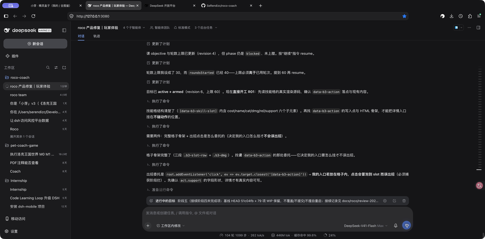

# DSH 上下文与目标核验

2026-09-29 14:20 Asia/Shanghai。真实DSH3080「roco 产品修复｜玩家体验」。HEAD51c04fb1488c7c629e659d6619b094bb92c6570a，未覆盖多人WIP，未重启服务。

界面显示上下文21%→23%；主agent在14:13–14:16仍能收团队消息、运行检查并复核产物。未见context超限报错。其连续自述上下文硬边界不足以证明实际耗尽；此前60%下降到21%提示可能自动压缩，需agent核对，不直接断言。

更明确的中断：阶段四第40轮达到目标上限，UI显示「受阻的目标」，与末尾「目标保持active」矛盾。用户没有要求暂停。已发送聚焦纠偏：保存短交接、查压缩、接续未完成具体阶段，保留团队成果；直接实现R01技能详情、R03上屏、R02阵容改进、R04真实存档复核、R07代码残留和G3。未授权重启仍保留。

14:20消息已显示在真实对话中，主agent开始新一轮。仅唤醒不是接续成功，还须核验目标恢复与真实实现工具。

随后DSH亲查并承认：phase=blocked，reason=round-limit，40/40，activation=disarmed。已保存阶段五接续记录，实际更新并resume；真实界面已显示进行中的目标、暂停目标按钮、停止生成、上下文24%，工具步骤1086→1098。目前目标恢复成功，尚不能宣称技能实现完成。

