# 2026-09-29 产品纠偏：按玩家实际任务交付

用户授权 Codex 把 DSH 接续到新对话。本文是 Codex 根据用户此次 12 张截图编写的修复要求；旧报告只作为历史证据，不能覆盖用户最新要求。截图是用户当次实际体验，具体 HEAD/服务版本尚须对账，不能直接说是当前工作区缺陷或已修。

## 已查出的方向偏差

旧 DSH「roco team」在 10:07 左右可见：连续多轮重点修候选数据审核、报告数字和判据，自己多次承认漏验、假阳性和未测即称实测；同时反复报告 8765 进程未重启。静态HTML/JS可能读盘更新，进程内代码可能仍旧；不能仅以启动时间断言整个前端旧，也不能以临时服务截图通过证明用户页面改善。上下文 61%～65%只是状态，不是降智证明；持续重复错误、重点偏移与玩家问题未解决才是需要新对话的依据。不能宣称「完美交接」或「全功能已做好」来代替实际确认。

新方向：先交付一条清楚、紧凑、可信、可操作的 盒子→详情培养→六只配队→战斗→问小芽下一步→结算复盘→下一局 流程。每批必须有玩家看得见的产品变化。报告/测试只为这条变化服务，不把不断修报告当产品开发。

## 新主 agent 的执行约定

1. 先读 ../DSH-HANDOFF-2026-09-29.md，核对实际 HEAD/WIP/服务/团队后确认接手。旧对话仅保留追溯，旧团队保存断点停止写入后再分发，不能两队同改文件。
2. 建立有边界的持续目标：首批先解决小芽唯一入口、可滚动布局、实质下一步建议和结算内复盘；并行处理详情/配队的信息层次及战斗相性。目标阶段完成后主动选择剩余已授权项，不等用户再喊。40轮临近时按实际未完成内容交接下一阶段，不为刷计数重开。
3. 使用 2～3 个明确写域的成员：A 小芽客户端/coach建议；B 盒子详情/培养/配队；C 战斗展示/相性/结算。roco.js 等共用文件只给一个拥有者，其它成员通过接口需求交接。主 agent 必须亲自做整合、跨模块状态一致性、服务版本对账、截图审查和最小必要修复，不能派完就等。
4. 开始修改前写轻量任务卡：问题编号、文件范围、复现、期望、依赖、验收；每批只做关联事项。允许有界等待依赖，期间做自己的独立项；不能为了「不许等」反复造新检查、乱改测试、抢别人锁。
5. 任何测试前保证 Chrome 禁后台联网/组件更新，异常和超时收尾，复用专用 profile；不跑 git show HEAD 的旧脚本验证新 WIP。不清玩家/浏览器数据、不重复起服务、不让多浏览器并发共享profile。流量事故专项被用户搁置，但安全测试前置不能丢。
6. 27B 暂缓；4B 用户亲自训练；数据/模板已有成果保存但降低本批优先级，不下载/训练/改主模型，不读取或记录密钥。
7. 8765 服务更新必须纳入交付：逐项区分「工作区实现」「临时实例验收」「用户服务生效」。先查当前真实页面与新代码差异；需要中断或重启用户服务时，完成可审查修复和回滚方案后再请求必要授权，不能悄悄重启，也不能把多年不更新当正常交付。用户端仍旧就明确写未生效。
8. 以真实业务失败定义测试。必要正反例围绕错误状态/非法行动/过期回答/切换配置；避免每个可逆排版变化新增源码文本钉死测试。已有测试需要调整时说明语义为何变化，不能删红项来充通过率。
9. 交付表逐问题列：未开始/实现中/代码已改/独立验收/用户服务生效。每条含版本、复现、同视口前后截图、短证据与下一步。不要只交测试总数或大篇自我反省。

## 截图问题与明确验收

### U01 盒子「天分认不出」、卡片空白大（图1、12）

真实值要追到导入字段、培养状态和展示映射。「天分」「资质」「刷新天分记录」须明确含义，不把三者混成一个字符串。映射已知值并保留原始值；确实缺失就写具体缺什么及可执行补救，不能全列表机械显示「认不出」，也不能凭空生成。

卡片只保留名字/形态、可辨形象、属性、等级和最重要培养摘要。收藏为轻量动作；高度随内容合理统一，多实例不能把整个网格撑出大片空白。抽查正常导入、空值、旧字段、刷新后的列表/详情/战斗/小芽一致；刷新不由验收擅自消耗用户剩余次数，可用隔离测试数据。

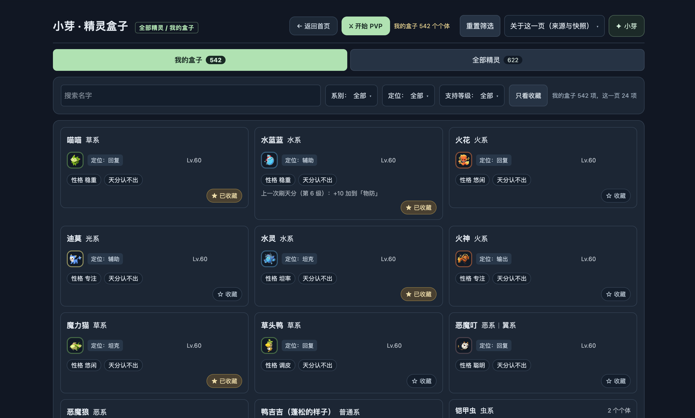

### U02 详情巨大空白、等级长条、形象太小（图2）

顶部用紧凑精灵摘要（形象、名称、属性、等级、性格、资质），培养动作就近；等级不用整屏空条。宽屏两区按信息组织，窄屏单列自然阅读，不让单个标签占一整行大面板。不同长度名字、双属性、大图、390px无横向溢出，正常桌面首屏能读到核心摘要与当前四技能。

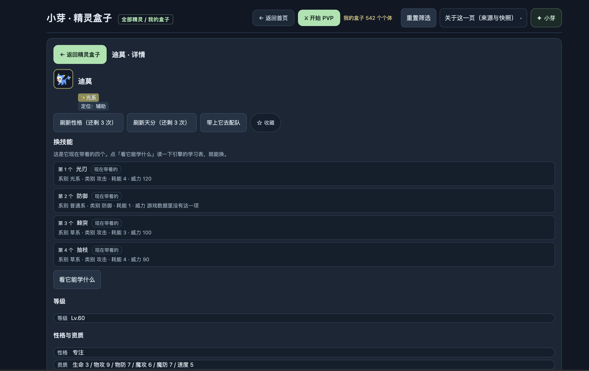

### U03 两个技能区域、技能无效果解释（图2、3）

只有一组「当前四技能」；替换时展开可搜索/筛选的候选，不再重复四张巨卡。技能展示名称、耗能、必要威力、一句真实效果与关键触发条件；非伤害技能不展示「威力 游戏数据里没有这一项」，用合适字段。技能来源放次级详情，仅当影响获取/合法性时突出。

沿真实技能数据/解析/引擎实施情况显示效果：资料中写了不代表引擎已结算。显示名称和明确限制，不把 skill_000xxx、来源或一堆机制词当效果说明。未实现决定性效果在选择时说明并给可用替代；不能隐藏缺口后继续假装可战斗。验收攻击、防御、状态/恢复和特殊技能；替换→保存→配队→战斗→小芽看到相同4技能，无重复、错来源、非法选招。

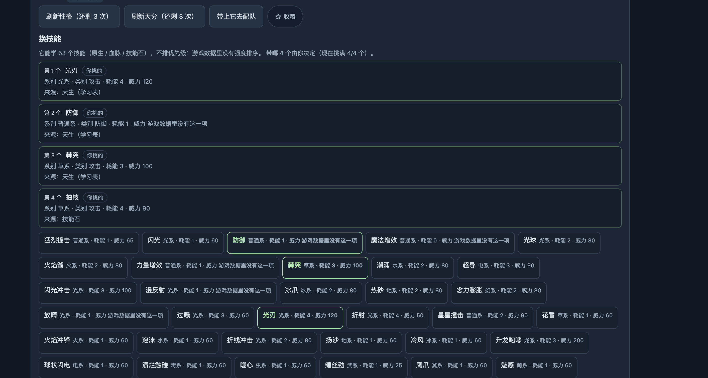

### U04 配队卡全是无效工程信息（图4）

六槽明确可扫读：精灵名/形象、属性、角色、四技能名、可替换和锁定。隐藏ID、「引擎规范配招」「机制线索」「算得出高低」等工程词到诊断详情。默认候选用已拥有，明确切全图鉴；未拥有不能和可用实例混淆。选满后点击候选应给「替换哪只」流程，不让玩家自己猜先删谁。

合法学习表核对作为自动校验流程，在用户确认应用时运行；展示逐只具体问题和修法，不要求玩家先理解「六只四技能」。小芽给可直接预览/应用/撤销的完整6×4配置，保留锁定、使用真实已拥有个体。验收一键替换、锁定保留、搜索筛选、合法应用、撤销、开局配置一致。

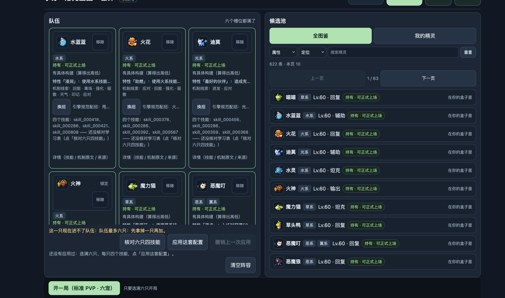

### U05 换精灵后克制/被克制标记丢失（图5、6）

技能和换人候选都基于当前双方属性重新计算显示；颜色配箭头和文字，不只靠红绿。技能克制倍率、自己受到威胁与换人候选防御相性不能混用。切换双方、倒下强制换人、属性变化及合法动作更新后仍正确；旧请求不能把新回合覆盖成过期信息。不能通过恢复固定箭头骗过视觉验收。

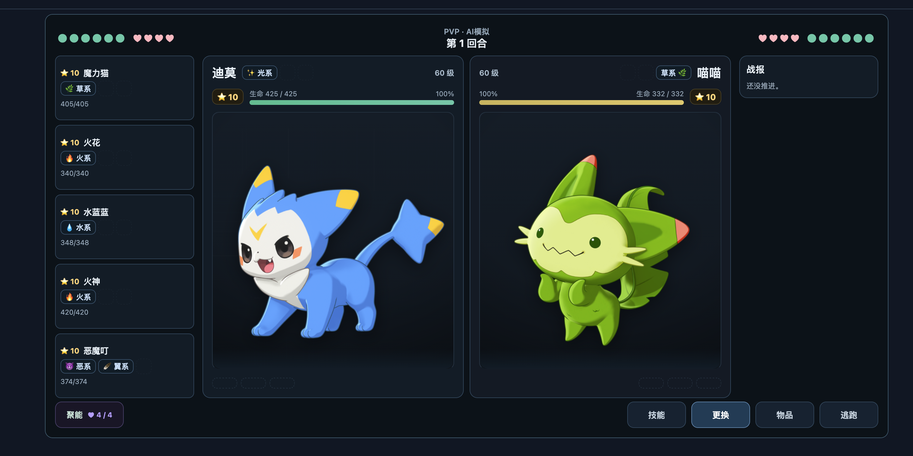

### U06 引擎/战报说不清、信息冗长（图6）

战报先呈现玩家事件（谁用了什么、伤害/恢复/状态、谁倒下），把估算和未核验影响保留为简短相关说明，原始 per_use_ramp 等键必须译成实际含义或明确未知，不能刷整段工程日志。状态、能量、聚能和合法行动在界面上有一致解释。做至少一个完整六只本地训练战斗，核对伤害、能量、状态、换入、倒下和胜负，没有虚构实机机制校准。

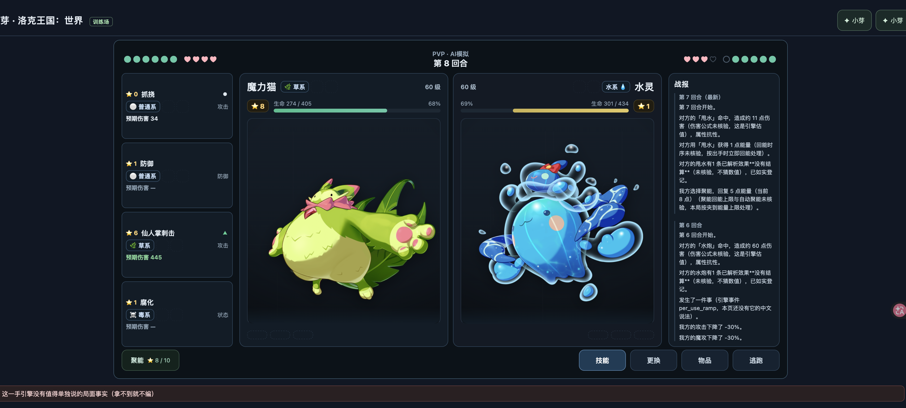

### U07 小芽重复按钮、面板挤、不能舒适向下看（图7、8）

每页面仅一套小芽入口和实例；事件监听/宿主挂载/重复mount同样去重。桌面采用不遮挡主要战斗动作的稳定侧边面板（窄屏可用抽屉），固定简洁标题和输入区，中间对话独立滚动。模型/资料状态、模式、记忆管理进入可展开次级区域，默认对话占主要空间。回答有行动结论、理由、可展开依据，不能一次大段填满。

新消息到来时：在底部则跟随，正在阅读历史则保留位置并提示新消息；展开依据、发送、回合变化不让全页滚动/布局跳。390×844及常用桌面视口测试长回答、输入法、多轮滚动、关闭重开与跳转详情。连通状态不能同时说「DeepSeek已回答」又「状态未知/还没拉起」却无准确更新。

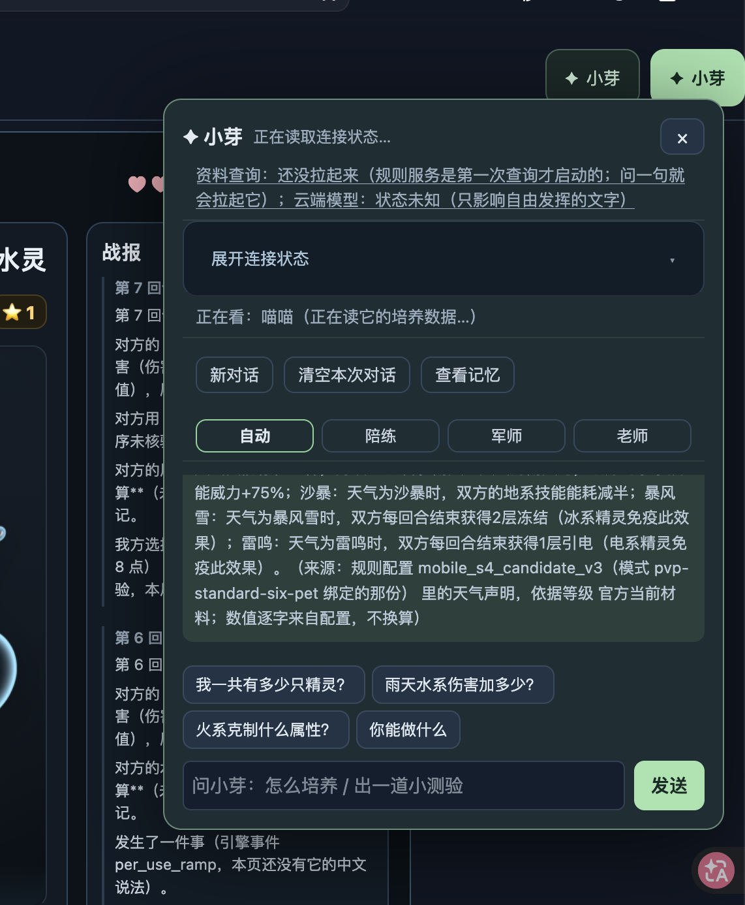

### U08 问「现在怎么办」却反问让自己定（图8）

用户明确要建议时应先给一个当前合法且有价值的首选行动，再给简短理由、收益与主要风险；有执行入口时提供「查看/采用建议」，确认后走真实宿主行动，不能擅自替玩家出招。可附一个备选，不能用「还是你自己定、说说倾向」替代建议。

缺数据时主动获取当前可用战况/队伍/合法动作；缺候选评估就实现最小真实比较，不能把没roco_plan当永远无法建议。确实无法判断时明确哪项未知和能立即做的安全步骤，不编未公开对手信息/速度/精确伤害。当前战况优先于旧记忆、盒子当前浏览精灵和上一局记录。

验收至少：普通回合、对手换上新精灵、低血量危险、己方倒下强制换人、能量不足、无模型的本地档、模型实际连通档。每次建议引用当前精灵/回合，行动在最新合法集合；状态变更后旧建议失效。不是回答多了几个名字/血量就算有用。

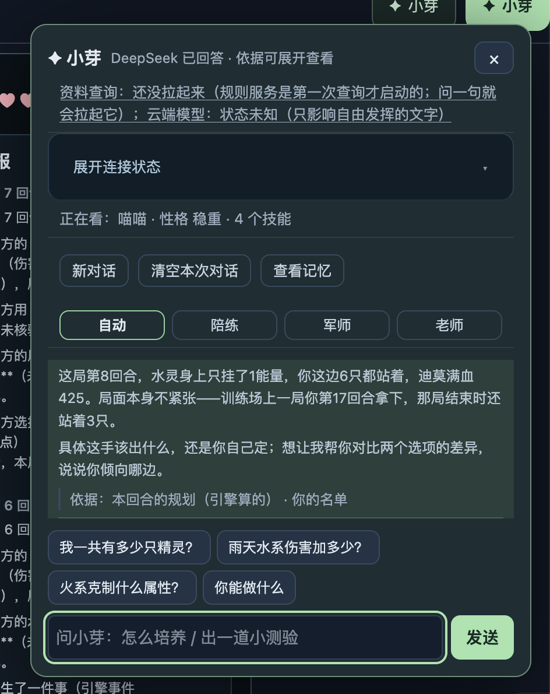

### U09 主动提醒毫无帮助（图9）

删除或改正「这一手留到局后，按你判断走」这种无信息气泡。主动提醒必须说明具体风险和可行行动；没价值时安静。玩家主动问不受自动提醒频次预算的误伤。hint-budget 等内部理由不直接上屏。倒下必须提示可换的合法存活精灵，不能预算用尽后沉默或继续推荐已倒下对象。检验刷新、去重、过期取消、静默偏好，别让气泡挡住换人按钮。

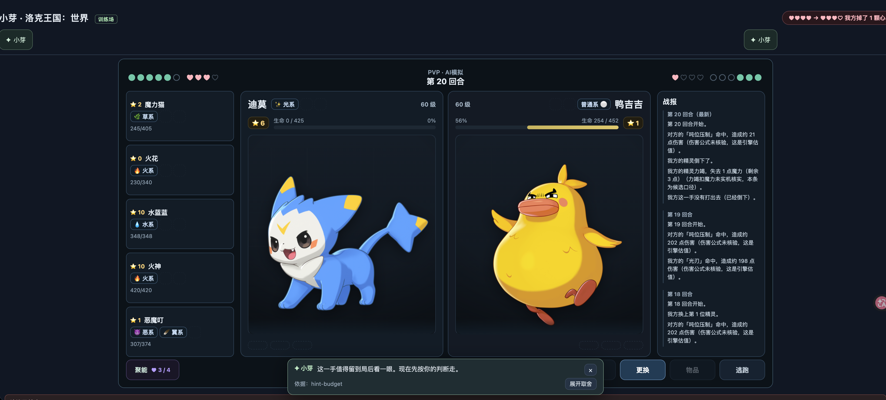

### U10 结算和复盘脱节、整页被新增长条挤跳（图10）

结算对话框里整合结果、一个关键决定、为什么及下一局练什么，再给再来一局/调整队伍/培养/问小芽。点「问小芽」直接在结算内接续这局上下文，复盘不另插在背后页面顶部把整页挤下去。详情默认折叠，关闭返回稳定位置。

复盘必须讲具体回合、当时事实、合法替代及理由；不要复读「确认它是谁什么系」两遍，也不要拿单次伤害写绝对结论。胜/负/逃跑/异常结束分开，正常开下一局清掉旧局建议，训练目标保留且可验证。

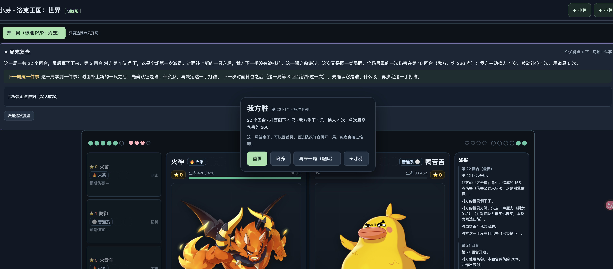

### U11 图鉴分页不填满、列数与页容量不匹配（图11）

正常非最后一页不应因固定24项搭7列而故意空半行。选择合适固定列数与整行容量，或基于容器宽度的稳定分页/加载；调整视口保持数据顺序、唯一项、总数、焦点和翻页可访问。页长变化不丢项重复项，最后一页允许真实不足。分页/容器边框不过大，图像是卡片主识别元素而不是角落小点。

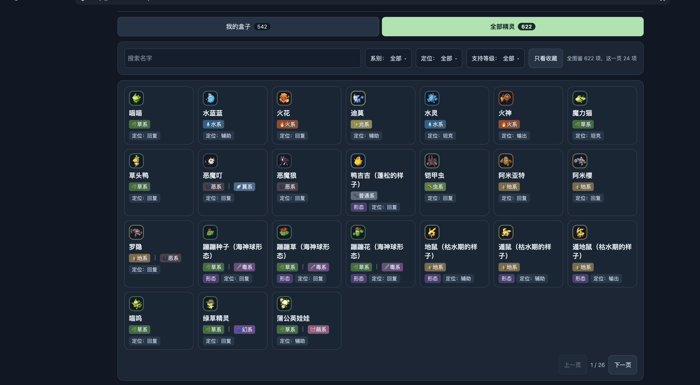

### U12 铠甲虫多实例呈现和巨大嵌套框（图12）

物种/形态摘要 + 「2个体」展开独立实例，每个有可辨实例标签、等级、性格/资质、收藏和去培养/配队动作，别无名字无图地嵌套两大空框。「本机加的/待导出」解释真实来源和缺字段，不伪造已导入培养值。不同实例不能共享错误ID/覆盖对方配置，应用到战斗能证明用了哪一个实例。单实例/多实例/未导出都验收。

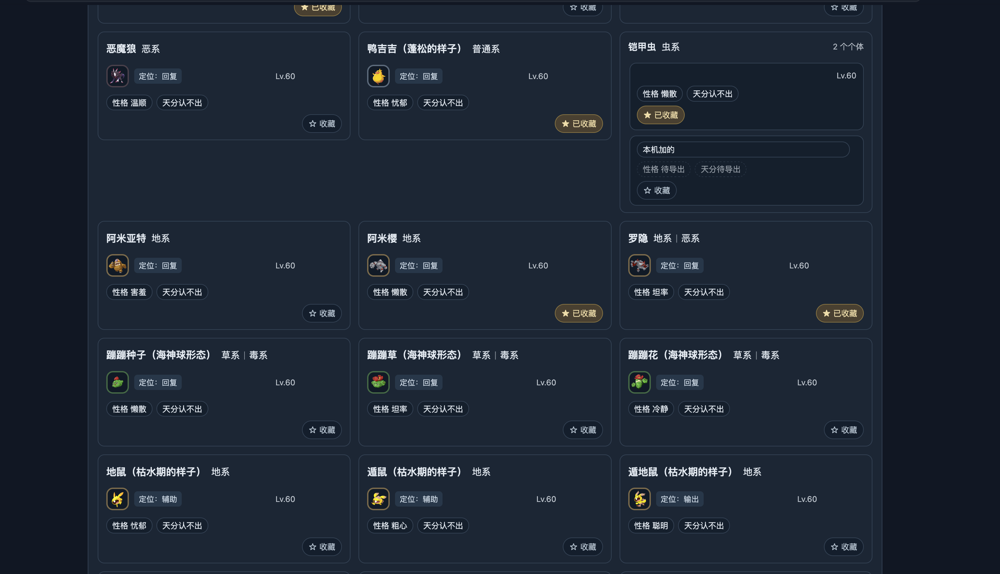

## 第一批可交付与验收顺序

- 第一批：U07/08/09/10，唯一小芽、舒服对话、真实行动建议、结算内复盘；U05为相关战斗回归。先对齐8765运行版本，已在新代码修的复测而非重写。
- 第二批：U01/02/03/04/11/12，紧凑且看得懂的培养/技能/配队与实例呈现。统一读写数据、完整6×4预览应用撤销。
- 第三批：U06及完整闭环、全部已拥有范围的可玩与立绘清单、机制明确缺口，再验证下一局迁移和独立宿主。

每批要由主 agent 亲自走真实页面；保存同视口前后截图和简短操作序列，含实际URL、运行版本及工作区版本。只在临时服务生效的不得标用户体验已修。未实现项一直留在表里，不能换标签宣称完成。不靠换模型解释所有问题：UI布局、数据通路、合法动作与服务版本先做好。

## Codex 交接核验补充（10:12左右）

旧 DSH 已暂停持续目标，UI无运行成员，四人报回安全断点；终态 HEAD `0e1793c`（交接首页84a68c8是WIP快照，不是最新HEAD），Codex读git实测同值。工作区此时只多本目录未跟踪文档/12截图，属于Codex此次产物，不要当旧DSH漏保存。8765 box.html HTTP200。旧交接关于“归属不明Chrome约26/28个”和锁存在/不存在是不同时间的自报，接手时实时核验，不要按旧数杀进程/删锁。

旧DSH说云端configured/verified已经为true，这只是配置状态，必须测试本次云端调用和回答效果，不能等同用户问题已解决。旧修复带名字/血量的402字答复只证明上下文使用，有没有首选行动、理由和合法性仍按U08判断；不能把它当用户投诉“让自己定”的充分反证。格子不排满明确指图11图鉴分页（7列24项），不是只验六槽。
