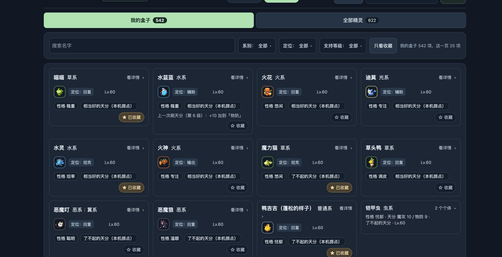
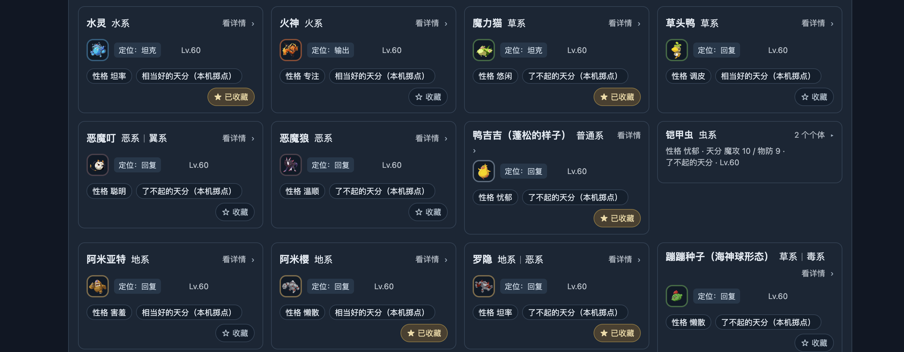
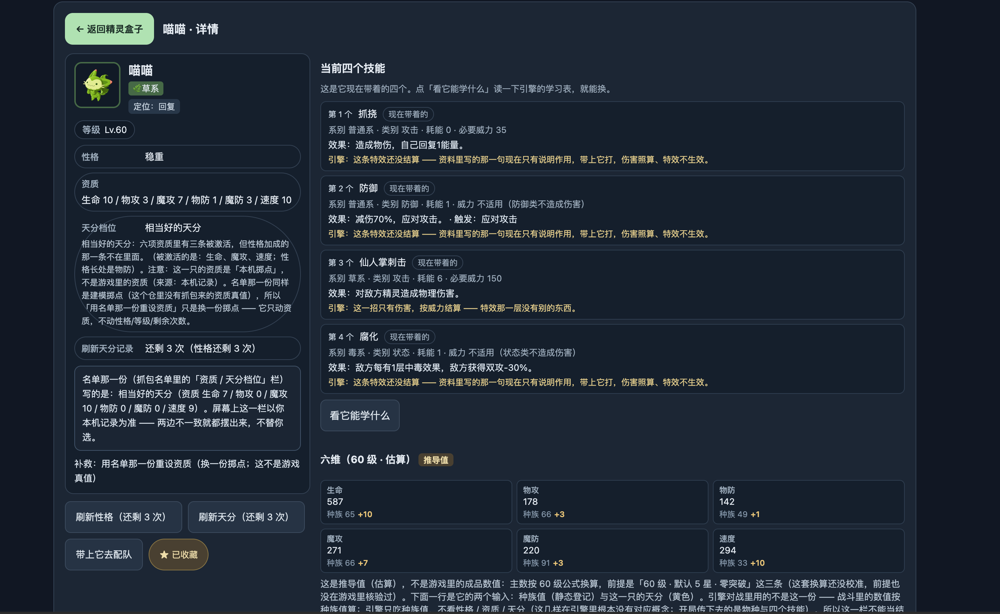
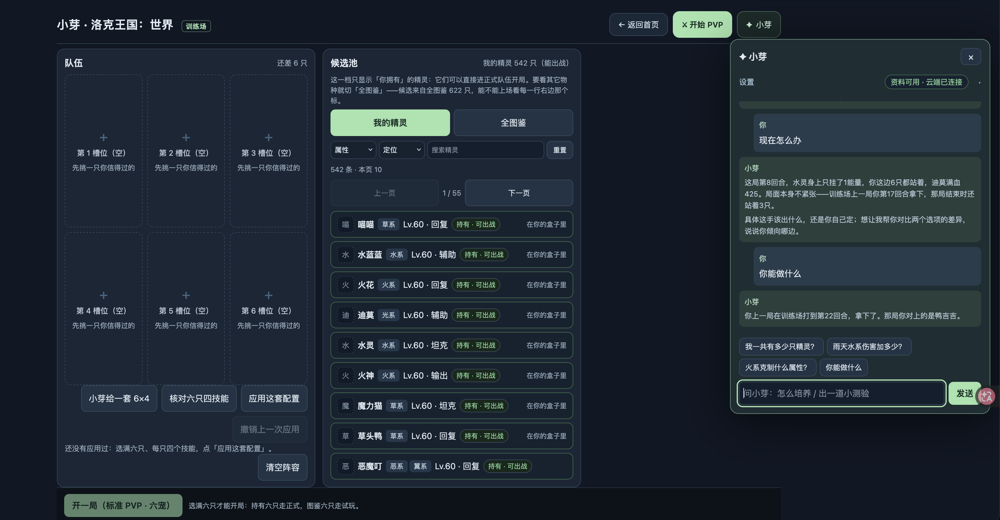

# 第三轮纠偏（最新用户决定优先）

基线HEAD51c04fb，多人WIP保留；当前DSH「roco 产品修复｜玩家体验」。本单覆盖此前要求把来源免责声明放默认界面的解释。不把以下截图当当前新问调用或全量机制证据，须实际复现。

1. 盒子默认列表删除所有「本机掷点」文字，上一次刷新/历史放详情；其他玩家可见页也删除该词。内部来源字段保留以保障数据一致，来源/技术诊断收进专门开发材料，不用替代措辞再铺满屏。第一排名字+「详情」，第二排属性（双属性也不挤名字）；短性格/天分标签采用约6–8px圆角、内容自适应，禁止巨大长胶囊。移除支持等级筛选、「关于这一页」、重复黄色箱子计数文字。将重置筛选移到筛选行（用户“充值筛选”按“重置筛选”理解）。收藏保留功能，可用短星标，计数在tab即可，不额外重复。
2. 铠甲虫分组关闭/展开都要有图，名字正常、个体数量一眼可见，外卡同宽同高，摘要别堆多个数值；两只真个体在展开后分别可识别/培养/选队，确认重复来源映射，不删玩家记录清截图。长名字/形态同样不挤属性/详情箭头。
3. 小芽不挤正文：默认浮层/抽屉开关不得改变盒子/配队正文宽度/位置或导致重新排版。桌面叠加层能收起；390屏用完整浮层而非把正文压窄。消息独立滚动、输入固定，正文原有滚动位置保持。图4有旧消息，必须新问「现在怎么办」「你能做什么」实测。
4. 用户最新明确本地机制可以采用固定规则，不要求逐项完全复刻真游戏。不要以缺真机公式阻挡可用产品。需要正式声明并版本化一个本地训练规则：六维计算/性格/资质/天分、伤害/防御/聚能/回复/状态/应对时序。同一个体列表详情数值、培养刷新、战斗实际stats、小芽工具、推荐必须读取同一规则同一投影；六维不是只改“推导值”标签，也不是UI算一份战斗另用种族值。玩家展示「训练属性」或正常六维，训练场一级说明足够；不宣称真游戏战力。
5. 技能「没有结算」先审查当前coverage与真实结算，不把静态全824 unsupported字段当执行真相。尤其图3防御说明70%却称特效不生效，须前后状态/事件实测校准。先拉起常用战斗原语并让组合产生真实效果，优先本次推荐/已选四招；按规则实现能量回复、减伤、持续/层数状态、双攻升降、应对触发等有明确参数的行为，缺参数需在本地规则显式定义并与原始资料区分；不要让每条技能只输出免责声明。未知复杂机制保留可查看的限制，推荐不能依赖未实现效果。新技能详情必须读真实效果支持，不再“全量都未结算”。状态招不得假报伤害。
6. 今晚用户亲自4B训练，DSH只准备不自动训练/下载/切主模型。检查实际工具清单/参数/提示词模板/启用思考/输出格式一致、失效inspect_training清理、分组审核数据、冻结测试、实际可执行工具任务评测、长度与准备快照。新固定规则如改变训练标签要版本绑定，别边改规则边把旧数据宣布ready；训练首版聚焦工具路由和依据结果短解释，不要求4B背完全部精灵或填补引擎缺机制。交付实际数据路径、准备缺口、用户可运行短试训命令与旧v8对照入口，不伪称ready。

复用空闲成员做盒子UI、小芽布局、训练准备；主agent保留R01技能详情/引擎统一与整合；已有advice-engine任务保持，不重复写域。服务重启不擅自做：后端代码可准备、独立临时验收，无重启授权则如实注明8765未生效并继续前端。HEAD与WIP记录，截图同视口，按真实功能验收，不再仅汇报绿测数量和长自省报告。临近轮数上限保存具体断点自动接续，不能说成上下文硬边界。

## 图1

## 图2

## 图3

## 图4

