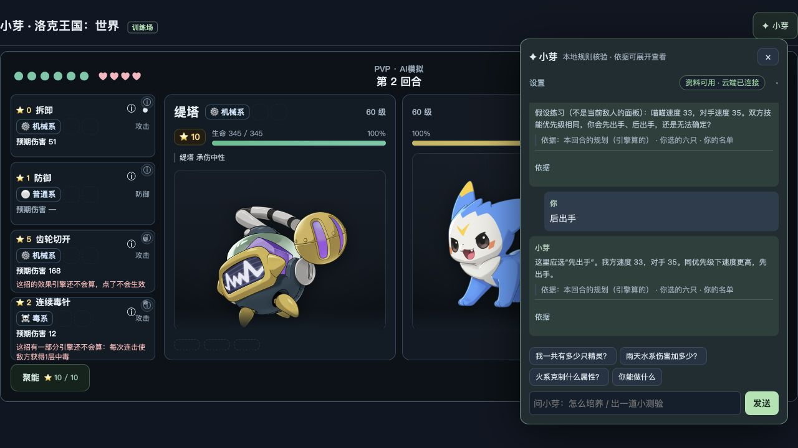
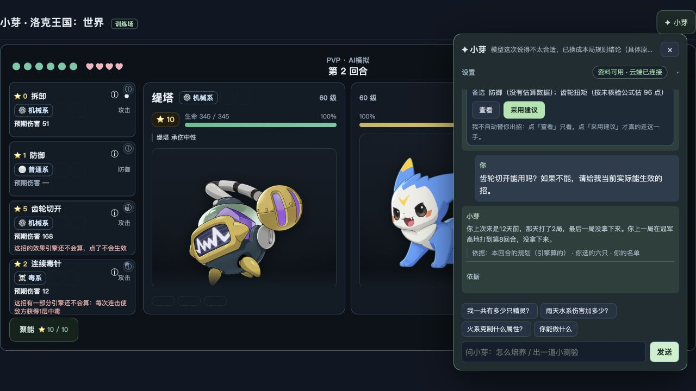
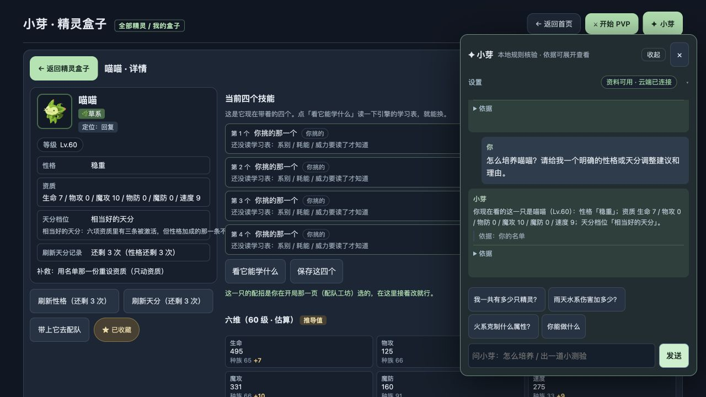
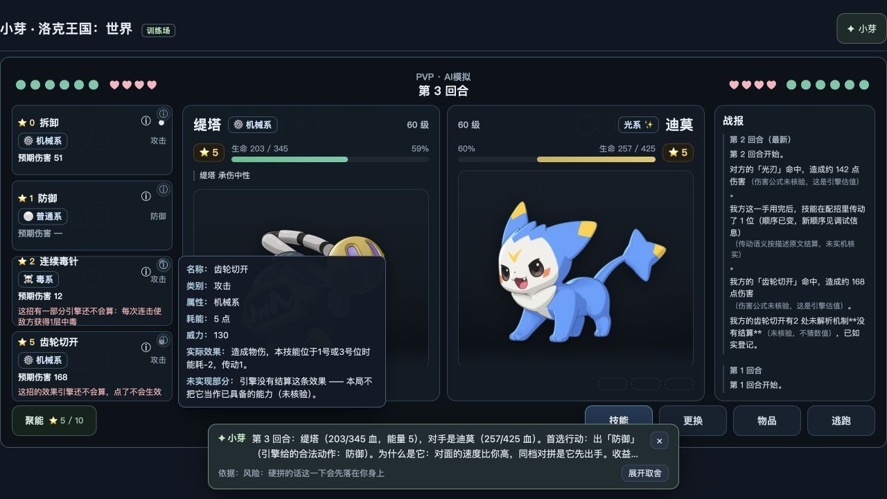
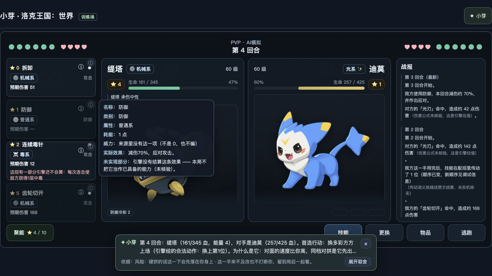
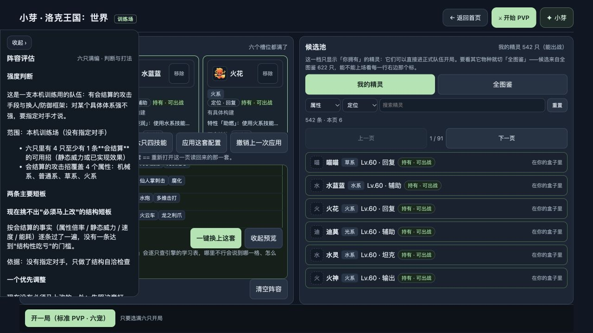
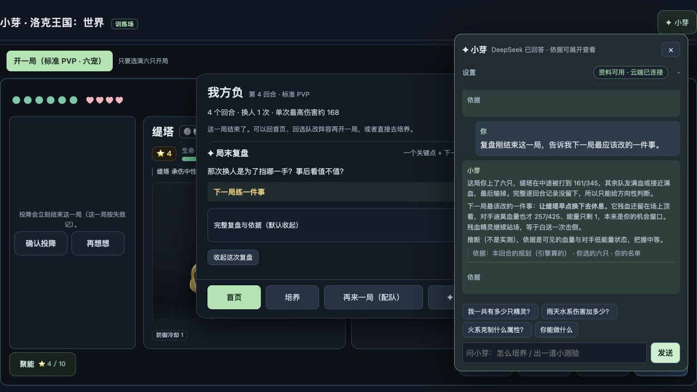
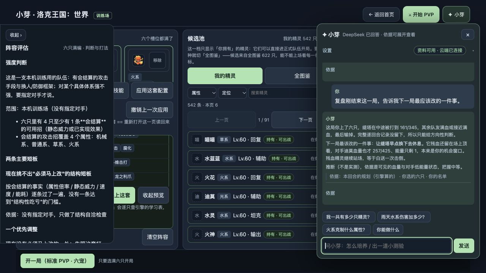
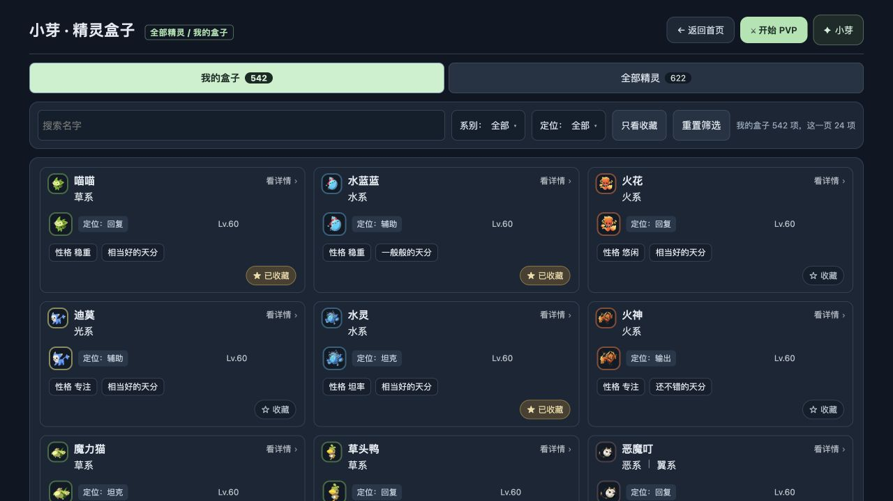
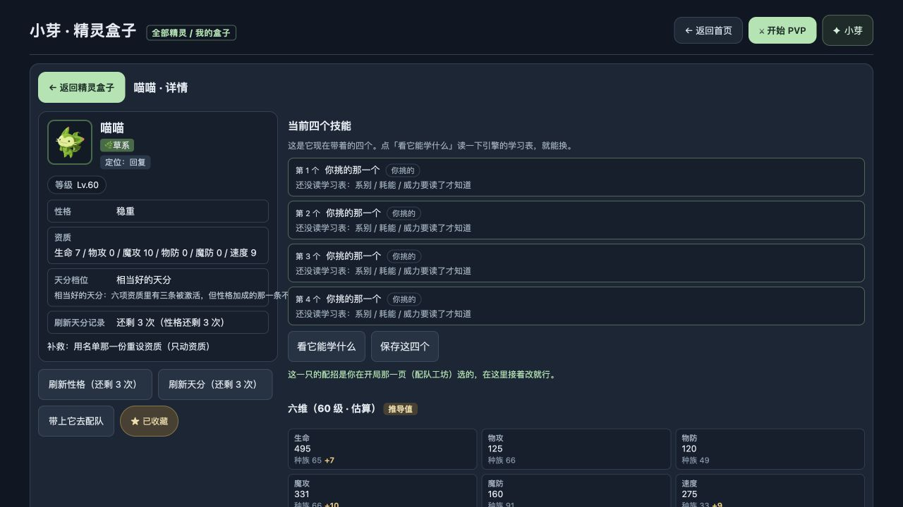

# 第三轮实测：还不能算“做好了”

2026-09-29 15:40，实测 http://127.0.0.1:8765 ，版本基线 `51c04fb`，另有 DSH 正在修改的未提交代码。本轮使用独立测试浏览器，没有清空你的浏览器、修改你的精灵记录、重启服务或启动训练。后半重新进入盒子读取新页面；DSH 仍在工作，这份报告不把过程中半成品算作最终验收。

## 已经能走通的部分

| 功能 | 本次实际结果 |
|---|---|
| 持有数量查询 | 回答持有542只；同时夹带“本页给了48只”等不必要信息 |
| 雨天规则查询 | 能读到配置中的水系技能威力+75%；回答夹带全部天气说明。威力加成不直接等于最终伤害加成 |
| 自动配队 | 空队生成6只、24个技能，可以应用并进入标准六宠训练战斗 |
| 当前行动建议 | 新局提问后给出首选“换缇塔”；点“采用建议”确实换人并进入第2回合。能执行不等于策略已证明强 |
| 当前精灵识别 | 详情页问当前名字、性格，能答喵喵、稳重 |
| 结算位置 | 复盘区域已经进入结果框；继续问小芽的入口能打开。内容质量仍有问题 |

## 1. 教练把先手题判错了：必须先修

题目写我方速度33、对手35、技能优先级相同。我选“后出手”，它却说应该“先出手”。这会教错玩家，也会污染训练答案。原因已查到：旧的“速度加3”判断留在代码里，题目已经取消加3，答案没一起改。

要求：用题目实际速度计算答案，分别验证速度低、速度高、同速。玩家要求“当前战斗题”时，应读取场上的精灵；本次场上是缇塔，题却取了喵喵。

## 2. 小芽仍答非所问，培养只是报数据

这次重新发问“你能做什么”，回答12天前的对局历史；问“齿轮切开能用吗”，也答同一段历史。附带“简短说明”的主问题被吃掉，只答“记住了，以后简短说”。单独问怎么培养喵喵、要求明确调整和理由，也只复述性格、资质和天分。

要求：先回答当前问题；表达偏好不能代替回答。技能问题先解释实际可用部分；培养问题要给一个具体调整及其在训练规则中的收益。不知道时说明缺的条件，不能用无关历史顶上来。

## 3. “没有结算”既有真缺口，也有错误提示

不能把所有警告当成所有技能都坏了。本轮看到三类问题混在一起：技能有些效果没解析；引擎已经实现的部分被界面误报；建议又掺了另一套练习规则。

实测“齿轮切开”：扣5能量，造成168伤害，并触发技能顺序移动；界面仍说“点了不会生效”。它确有另外两处未解析记录，因此需要逐条区分伤害、位移和未实现效果。

实测“防御”：扣1能量，伤害从上一回合142降到42，约减伤70%；详情却写特效未生效。小芽先前承诺“额外回2能量”，实际能量5变4，没有额外回复。

要求：技能详情、合法动作、执行结果、战报、小芽都读同一份实际效果定义。已经生效的不能误报；缺失的常用机制要实现。复杂未知效果逐条放详情，别让玩家在主界面读一屏引擎声明。

## 4. 六维确实没有接入培养后的战斗属性

这不是把“推导值”三个字删掉就能解决。当前盒子按性格、资质计算一套数；战斗只接收物种和技能，另按种族值计算。喵喵详情生命495，本轮战斗名单生命332。

按你最新决定，固定一套训练规则即可。要求：同一个体的等级、性格、资质生成唯一六维，列表/详情、培养、战斗、小芽、推荐全部共用。刷新后能在下一局看见对应变化；训练场只需一次说明采用本地规则，不必每张卡重复解释。

## 5. 配出6×4了，但评估和打法仍不可信

本次评估写“混合面（6只里0只带—）”；替补竟列队里已有的喵喵、水蓝蓝、火花，还说属性未知；能量循环把“普通系”当招式名。队伍显示顺序以喵喵开头，推荐表与实际战斗首发却是多彩方方，玩家很难知道先上谁。

要求：先给简短强度判断、最明显的短板与一个改法；再讲首发、核心、常用两三步、能量不足怎么补、何时换人。首发和六槽顺序一致。选队要在固定规则下对常见对手实战比较，包括烈火战神；不要用静态威力最大代替合理核心，也不要把一局胜负当整体强度。

## 6. 复盘仍漏掉结束原因

我在第4回合主动投降，用来测试结算入口；没有任何精灵倒下。小芽却说逐回合记录没留下，并把失败归因到缇塔残血还站场，“等于白送一次击倒”。页面战报明明保留了换人、齿轮切开、防御和投降。

要求：复盘先读该局真实事件和结束原因。投降、正常击败、超时分别处理；不存在的倒下不能写成事实。下一局只带一个来自已发生事件的练习目标。本次仅验证再次配队能保留6×4，尚未证明教学目标跨局迁移可靠。

## 7. 小芽挤正文已量出来

同一个1280px视口，配队正文关闭小芽时宽1196px，打开变866px，少了330px。要求叠加浮层，开关不改变正文宽度、位置、滚动位置；消息独立滚动，输入固定。手机完整浮层即可。

## 8. 盒子已经开始改，但还不能验收完成

本轮重新进入页面已看到“支持等级”“关于这一页”和黄色重复计数移除，重置进入筛选行，“本机掷点”从当前列表和详情消失，历史刷新不再占列表，天分标签也缩小。

中途页面仍有两个精灵图标、文字“看详情”；最终应只留一个图标，按钮“详情”，属性第二排。同宽卡片、短标签、收藏星标即可。配队应用后回详情，四技能暂时都显示“你挑的那一个”，必须自动解析成技能名，不让玩家再点学习表才能认出来。

你的铠甲虫截图是两个个体；独立测试浏览器只有一个，因此不能用本次单个体页面宣称两个个体问题已修。要核对你截图中的两个记录来源与编号，默认折叠卡有图、同高，展开后分别可识别。不要删玩家记录来消除重复外观。

## 接下来怎么推进

DSH「roco 产品修复｜玩家体验」已建立阶段六，逐张读取你本轮4图，3位成员运行，主agent在核查真实引擎效果。它接手了删冗余UI、铠甲虫、叠加布局、固定训练规则、技能支持一致性、4B准备。上述新测验和问答错误另已发送。

优先修教错答案与答非所问，再统一战斗属性和机制，界面成员同时收拾列表/浮层。每批必须区分“代码改了”“临时实例通过”“8765真实生效”；本轮没有重启8765，不能把后端未生效代码说成用户已经用上。

4B训练前检查独立放在[4B今晚训练前检查.md](4B今晚训练前检查.md)。
