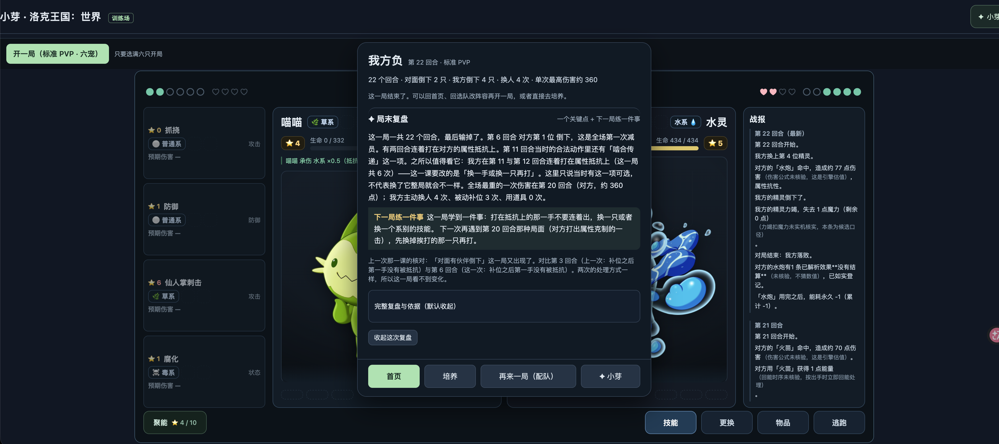
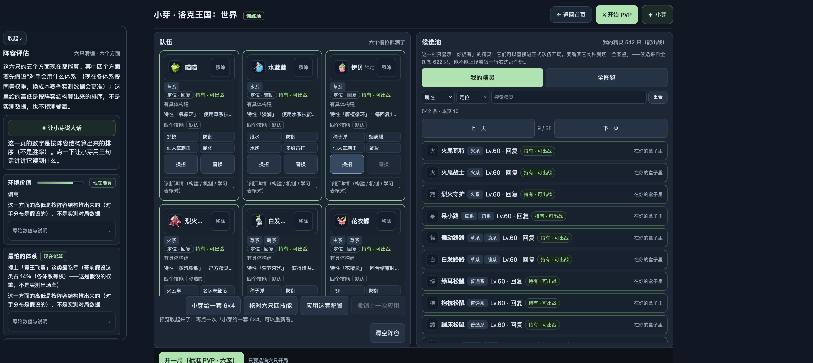
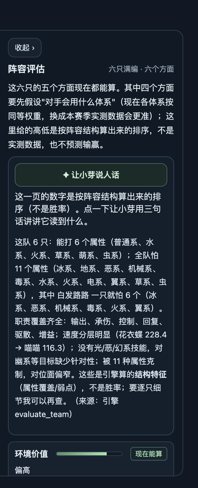
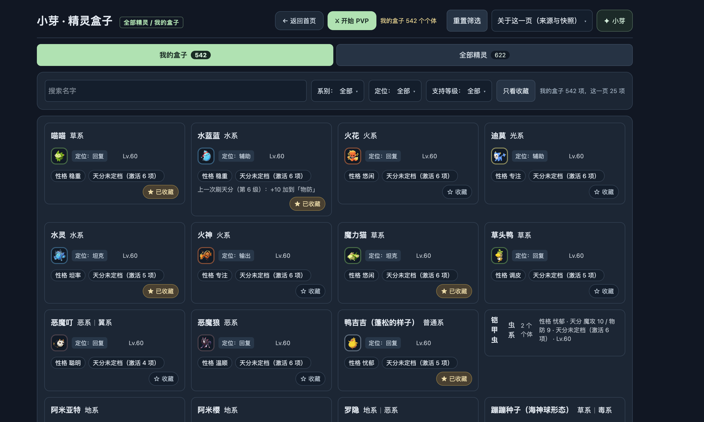
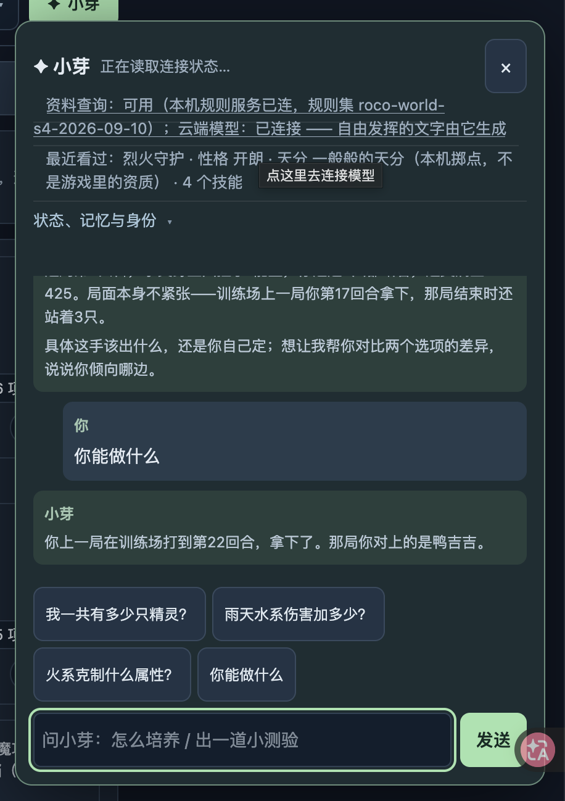
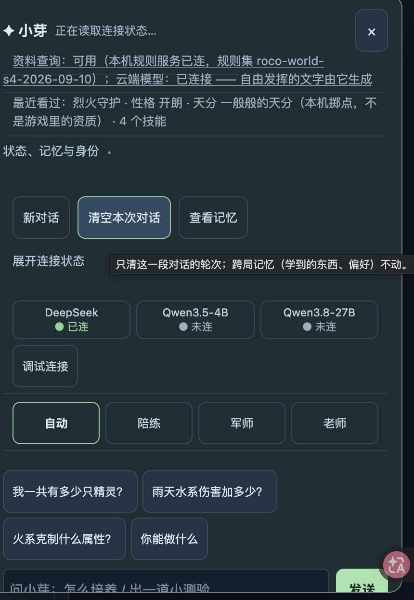
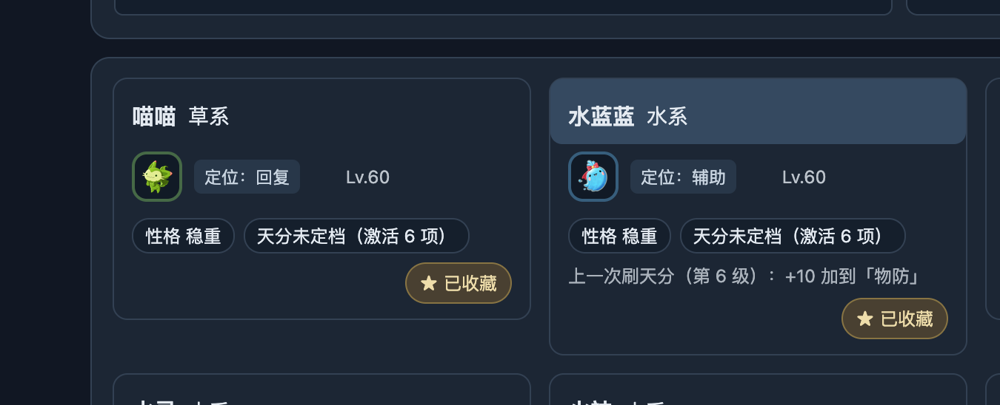

# 第二轮玩家纠偏：推荐要能教打法，界面要能用

基线 HEAD：51c04fb1488c7c629e659d6619b094bb92c6570a，存在多人未提交改动，不覆盖。用户最新7张截图是待修问题证据，不是验收截图。接续 DSH「roco 产品修复｜玩家体验」，保留旧 roco team 暂停。旧任务批次全绿不代表本清单完成。

## R01 技能实际执行与详情（图1）
右侧水炮明确出现「已解析效果没有结算」。查当前技能原文、解析效果、事件与前后状态，逐条区分伤害和附加效果；修可复现执行缺口，未知参数不能编造。未实现效果不能被推荐算法当作已具备战术能力。技能悬停和键盘聚焦显示名称、属性、类别、耗能、威力（状态招不强填威力）、条件、实际效果和未实现部分；移动端点击详情有独立入口，不误出招。验证正常、不可用、换人后、结算后四种状态，提示不遮挡操作、不越屏。

## R02 推荐阵容有打法（图2、3）
保存本次实际队伍、四招、培养、对手与回合记录（能取到才说取到了），分析被烈火战神击败的具体原因：推荐结构、配招、能量循环、建议/玩家动作、引擎不支持机制分别核对，不凭一次输局伪造胜率。产出真正完整合法且可执行的6×4；先给清楚的流派、核心、首发、基本循环、什么时候防御/聚能/换人、如何赢、最怕什么和替补方案。每个关键能力落到真实技能效果，不靠「职责齐全」或随便挑六只宣称强度。对烈火战神做少量确定性对照，与原方案/简单基线比较，保留失败与限制。保留锁定、采用、撤销功能和个体真实身份。

## R03 阵容评估重做（图2、3）
默认只呈现强度判断（在明确对手/本地训练范围内）、两条主要短板、一个优先调整、基本打法。没有真实对战样本不能说竞技强队/高胜率；可明确「适合练习但缺少对火系的稳定应对」等有事实依据的判断。移除大段等权假设、11属性枚举、反复来源声明及「让小芽说人话」二次翻译按钮。原始证据可放二级折叠。无法给有用结论就暂时移除无效侧栏，不用换文案冒充分析。与R02复用同一队伍和判断。

## R04 天分是玩家认识的档名（图4、5、7）
用户明确要「XXX的天分」，例如「还不错的天分」。调查档名映射、资质、激活项、本机练习掷点、旧存档和导入的真实契约，不能把「认不出」改成「未定档（激活6项）」就称修完。真实合法本机培养应有一致档名，列表/详情/战斗/小芽一致。真实游戏资料缺失不能凭空冒充导入结果；恢复性处理旧存档，保留刷新记录、原始值，不能为了凑四档无声截断/重掷/删除。给实际可用的数据修复途径和结果，而非每张卡一段技术解释。
补充当前复现：8765全图鉴迪莫详情显示性格待导出/等级—，小芽新问「这只的性格是什么」却回答开朗、Lv60。证据在 codex-healthcheck/巡检记录/巡检-2026-09-29-1340。区分物种/实际个体/本机练习记录，修上下文来源和答复，不能当成旧消息略过。

## R05 我的盒子与铠甲虫（图4、7）
统一紧凑卡片，图像足够辨认、名字不竖排、等级/性格/天分一眼读懂，减少框套框和无效留白。同种多只先检查实际个体ID和来源：导入与本机新增是否意外复制；真实两只保留并可分别识别/选择，错误展示投影修映射，不能删玩家数据清理截图。铠甲虫分组也须有图、正常标题和明确个体数量。
图7水蓝蓝名字出现蓝色伪按钮且用户点不动：核查标题/分组按钮的事件、hover/focus样式、命中元素、覆盖层和重绘。统一行为：标题若能打开详情/展开组则必须真能打开；纯标题不要伪按钮状态。收藏不误打开卡片，点击后返回保留筛选/页码/滚动位置。

## R06 小芽收敛（图5、6）
默认顶部只留标题、关闭和一个展开按钮；展开后只有少量必要功能键（新对话、记忆、模式/模型设置），连接细节放二级设置，不把长状态、规则集ID、最近看过培养诊断塞在默认消息上面。独立消息滚动、固定输入、窄屏不挤/跳。新问「你能做什么」需回答可执行能力而非上一局内容；新问「现在怎么办」直接合法首选动作、理由、风险，不让玩家先自己定。截图里历史消息不是新调用证据，必须新问实测。主动预算不能挡用户主动问题。

## R07 去掉27B（图6）
用户最新决定覆盖「暂缓」：移除27B在产品中的选项、连接按钮和无用占位/探测。保留4B（用户亲自训练）和当前云模型必要设置。此次指产品入口和配置路径，不删除模型权重/训练数据、不下载/训练/切换主模型、不查密钥。

## 执行和验收
请将R01–R07加入真实持续目标。主agent保留整合、战斗效果和真实8765验收；复用空闲成员划分小芽UI、推荐/评估、盒子/培养，明确写域，style.css有重叠需分段协调。不强行打断仍活任务、不无限加队员。G3倒下动画保留断点，可由Lead收尾，不让一条飘字探针独占全部后续轮次。无需再次迁移对话，当前未见必须迁移证据。

每批交付同视口前后截图、真实URL、HEAD+WIP与服务资源/后端版本，区分代码修复/临时实例/8765实际生效。推荐有合法招式并不等于好用，评估文案变短不等于真能判断，回答加名字血量不等于会指导。前端先交付R05/R06及技能详情；推荐与天分依据调查并行，不等全套调查才做视觉改进。保留当前服务和存档；需要后端重启时准备具体影响、恢复方案与验证点，不能自行突破已有禁止重启条件，也不能让它阻塞所有独立前端工作。禁止重复全量测试、旧HEAD测试验证WIP、无清理浏览器或后台组件下载。

## 用户原始截图

### 1. 技能效果未结算与局末

### 2. 推荐队伍与评估侧栏

### 3. 所谓说人话仍堆数据

### 4. 天分与铠甲虫卡片

### 5. 小芽默认头部及答非所问

### 6. 冗余设置与27B

### 7. 名字出现不能点击的蓝色按钮

