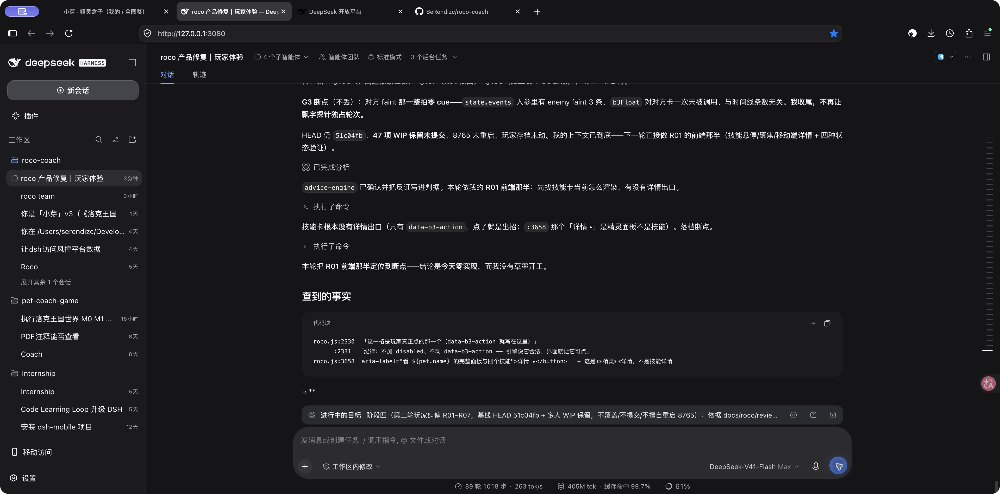
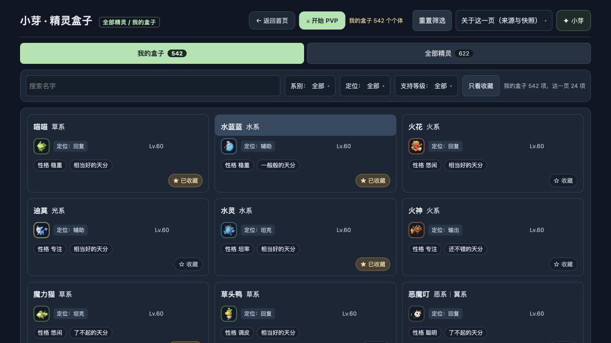

# 第二轮纠偏接收核验

2026-09-29 14:02左右（Asia/Shanghai）。HEAD 51c04fb1488c7c629e659d6619b094bb92c6570a，多人WIP保留。

已通过Firefox真实DSH3080「roco 产品修复｜玩家体验」发送，排队消息已被消费。Lead逐张读取全部7图、逐条复述R01–R07，实际更新为阶段四进行中目标，建立三条互斥写域任务，派给xiaoya-panel/advice-engine/box-team-ui；界面明确2个子智能体运行中，第四位保留独立复核。主agent继续负责整合与技能实际结算。这是开始执行的证据，不是产品已修证明。旧roco team保持暂停。

真实8765独立IAB复查：我的盒子水蓝蓝组头为expanded button，点击后仍在列表，不进入详情；单个体标题伪按钮问题复现。此IAB本机培养档名与用户Firefox存档不同，不以IAB已显示档名证明用户旧存档已修；未读/改用户浏览器存档，临时标签已关闭。

两小时现有监工已更新为最新七图和27B移除产品选项口径，未建重复周期。保留后端禁止擅自重启条件，代码已改不等于后端已生效。

下一项：核对各成员实际产物；先验小芽顶部收敛、盒子标题/铠甲虫，再验技能详情及6×4流派打法和烈火战神对照；按真实新问与状态转移验证天分和当前个体上下文，不能仅凭测试数宣称完成。

