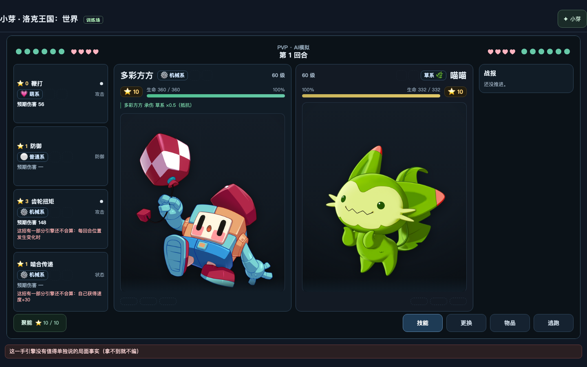
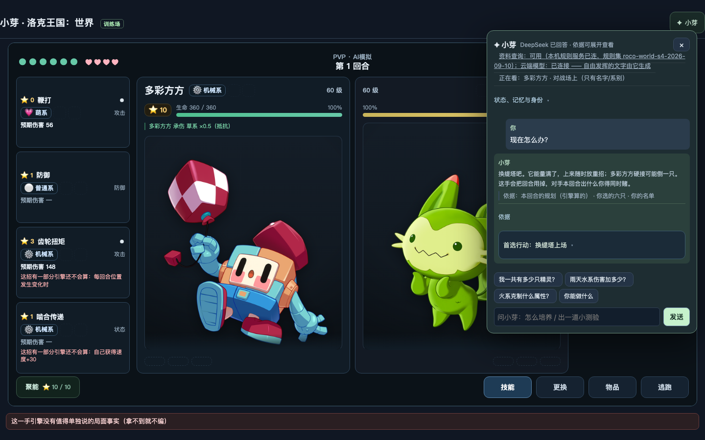
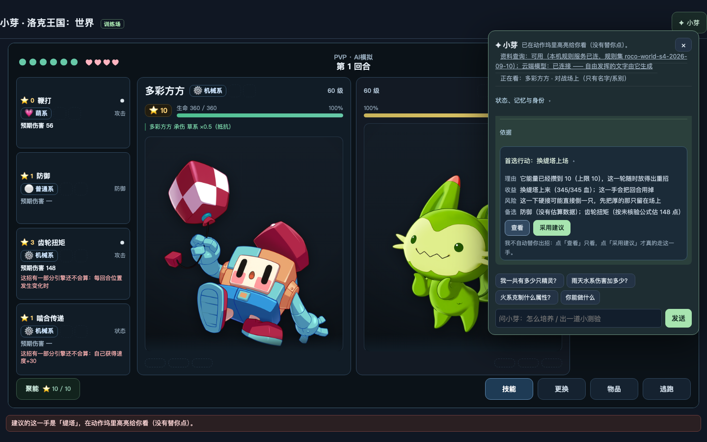
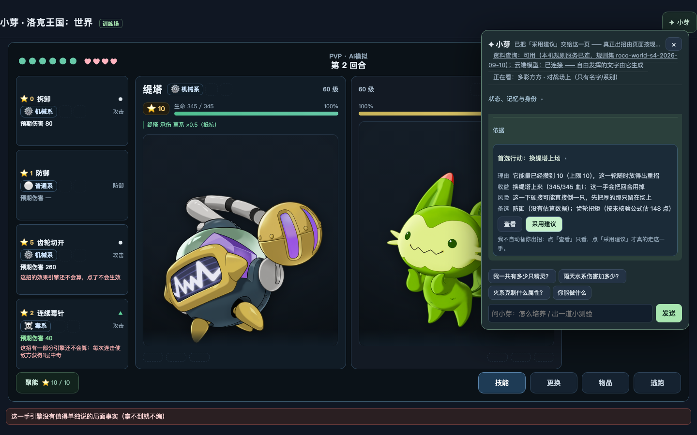
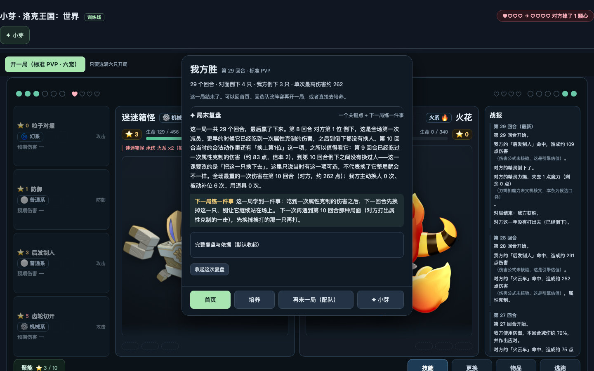
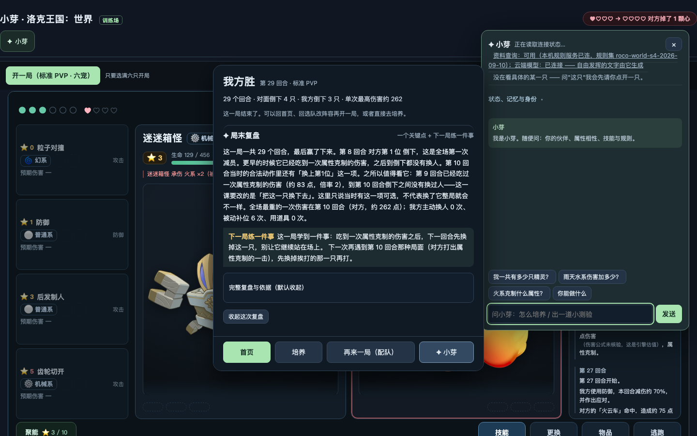
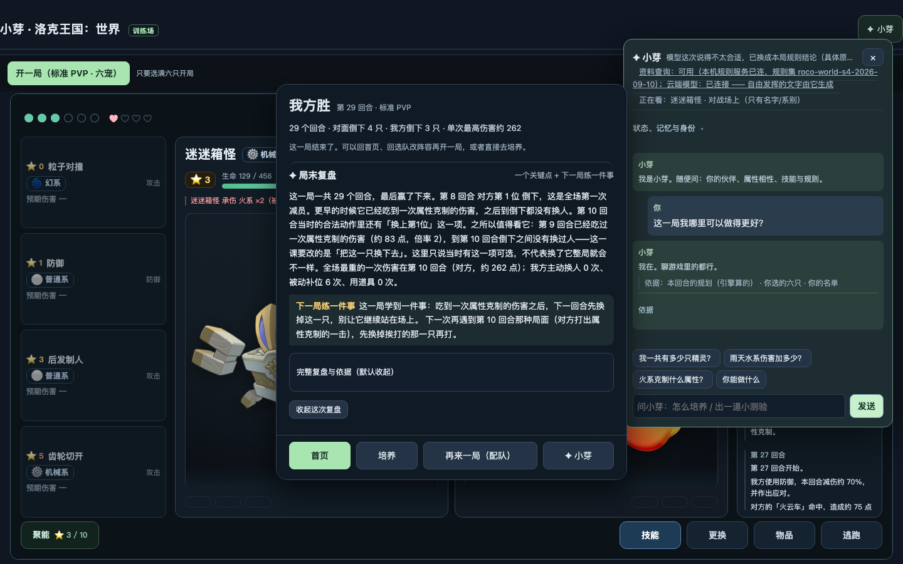
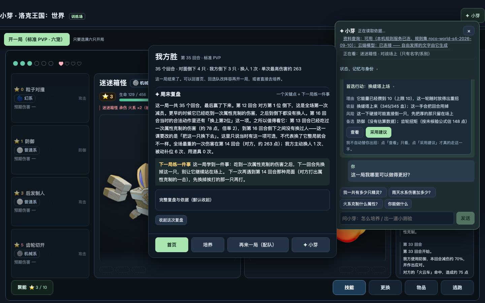
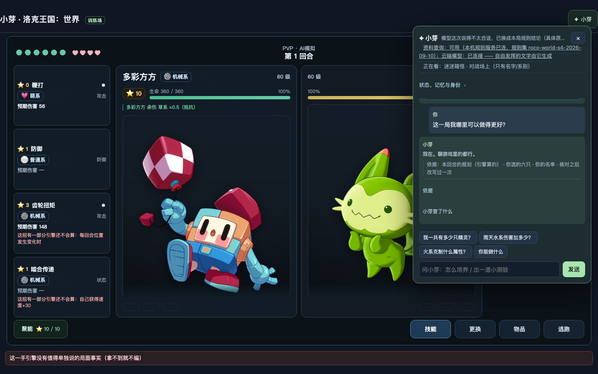

# 小芽自然任务链独立复验（task-8）

**复验人**：advice-engine（T2）｜**日期**：2026-09-29｜**HEAD**：`0e1793c4a8fc3f2e9a8cbdbff21cb5400c76a336`（未提交，git 归 Lead）
**目标环境**：用户正在跑的 **真 8765**（`http://127.0.0.1:8765`，**未重启**、未清玩家数据）
**方法**：真 CDP、真点击（`Input.dispatchMouseEvent` + hit-test，不是 `.click()`/读关键词）、真打字（`Input.insertText`）、
每一步取**点前/点后两张截图**与**逐值状态快照**（回合/双方血量/能量/legal 动作表/动作坞格数/建议卡字段/记忆账）。

> **写域纪律**：本次只写 `docs/roco/review-2026-09-28/xiaoya-task-chain-review.md`、`shots/xiaoya-chain/`、`tmp/xiaoya-chain/`。
> **未改任何 `src/**`、`tests/**`、`data/**`；未提交 git；未重启 8765。** 发现的缺陷**只报不修**（见 §4）。

---

## 0. 结论摘要（一句话版）

**一条链 5 步里 4 步通过、1 步失败**，另有 3 条独立可复现的缺陷：

| 链路步骤 | 结论 | 关键读数 |
|---|---|---|
| 1 局中问「现在怎么办」→ 建议卡片 | ✅ | `HTTP 200`、`provider=deepseek`、卡片五栏齐全（首选行动/理由/收益/风险/备选）、`legalActionId=switch#1` |
| 2 点「查看」→ 不许出招 | ✅ | 前后**逐值相同**（turn/phase/battleId/stateVersion/我方/对手/legalCount/动作坞格数），对局请求 **0 次** |
| 3 点「采用建议」→ 恰好一手 | ✅（首次）/ ❌（重复） | 首次 `Δ提交=1`、`turn 1→2`、我方 `360→345`；**重复点/重复广播各又出 1 手**（缺陷 D1） |
| 4 打完一局 → 局末对话框里追问小芽 | ⚠️ | 提问与回执链路通（`HTTP 200`）；但**屏幕渲染 ≠ 回执正文**（缺陷 D2），手机档回答还被结算框盖住（D3） |
| 5 点「再来一局（配队）」→ 目标还在/旧复盘清/turn=1 | ❌（目标那条） | `turn=1` ✅、`battleId` 变 ✅、旧复盘/提示有效不可见 ✅、`matchEvents=0` ✅；**训练目标被抹掉**（D4） |

**三态**：`代码已改` = 本轮**无**（复验任务，不写代码）｜`临时实例验收` = 引擎侧扫描用了 `createCoachServer` 端口 0 的临时实例｜
`用户 8765 生效` = **本次全部读数都来自真 8765**（U08 服务端已在 03:02Z 重启过，`started_at=2026-09-29T03:02:04Z`，建议卡是真的）。

---

## 1. 复跑命令与退出码

```bash
# 任务链（两档视口；每个阶段都会落截图 + JSON 读数）
node tmp/xiaoya-chain/chain.mjs      --base http://127.0.0.1:8765 --viewport 1440x900   # exit 0（问题见 §4）
node tmp/xiaoya-chain/chain.mjs      --base http://127.0.0.1:8765 --viewport 390x844    # exit 0

# 专门复验「局末对话框里追问小芽」（含回答可见性判定）
node tmp/xiaoya-chain/dialog-ask.mjs --viewport 1440x900                                 # exit 0
node tmp/xiaoya-chain/dialog-ask.mjs --viewport 390x844                                  # exit 0

# 边界（换人 / 己方倒下 / 无法攻击 / 请求失败）
node tmp/xiaoya-chain/boundaries.mjs --viewport 1440x900                                 # exit 0，问题数 0
node tmp/xiaoya-chain/boundaries.mjs --viewport 390x844                                  # exit 0
node tmp/xiaoya-chain/scan-noattack.mjs                                                  # exit 0（无法攻击：0 窗口）

# 训练目标跨局（D4 的最小复现）
node tmp/xiaoya-chain/goal-store.mjs   --viewport 1440x900                               # exit 0，问题数 1（= D4）
node tmp/xiaoya-chain/goal-timing.mjs  --viewport 1440x900                               # 分步采样，定位被抹掉的那一步
```

> **退出码怎么读**：这些脚本的 `exit 0` 只表示**探针跑完了**；判据结果在 JSON 的 `problems` 数组里
>（`chain.mjs` 每个视口会把问题逐条打印，`goal-store.mjs` 的 `exit 0` 也带 1 条问题 = D4）。
> 这样设计是为了「一条链不断在半路」：任何一步出问题都继续把后面的步骤跑完，读数才连得起来。

读数落盘：`tmp/xiaoya-chain/*.json`；截图落盘：`docs/roco/review-2026-09-28/shots/xiaoya-chain/*.png`。
所有脚本都抢/放 `tmp/browser-lock`（浏览器串行）、用专用持久 profile、收尾杀 Chrome；`--disable-background-networking --disable-component-update`；CDP 开 `Network.setCacheDisabled`（确保页面执行的是磁盘上那一份）。

---

## 2. 链路逐步读数（逐值，不是"看着对"）

### 步骤 0：开局（真点击 `#start-standard-pvp`，六宠）

| 项 | 值 |
|---|---|
| turn / legal 动作数 | `1` / `12` |
| 我方 | 多彩方方 `360/360`，能量 `10` |
| 对手 | 喵喵 `332/332` |
| 截图 |  `1440x900-chain-00-battle-start.png`｜`390x844-chain-00-battle-start.png` |

### 步骤 1：问「现在怎么办」→ 建议卡片

真点击顺序：`#coach-entry`（开面板）→ `#xiaoya-input`（真打字）→ `#xiaoya-send`。
读数（两档视口一致）：

| 项 | 值（1440×900 / 390×844） |
|---|---|
| HTTP / provider / route / cache | `200` / `deepseek` / `strategist` / `miss`（390 第二次运行为 `hit`） |
| 回答逐字（回执） | 「缇塔能量满10，换上来随时能放重招；现在这只多彩方方虽然厚，但这一轮大概率要硬吃一下。换不换得你定，这手会把回合用掉。」 |
| 卡片：首选行动 | `换缇塔上场` |
| 卡片：理由 | 「它能量已经攒到 10（上限 10），这一轮随时放得出重招」 |
| 卡片：收益 | 「换缇塔上来（345/345 血）；这一手会把回合用掉」 |
| 卡片：风险 | 「这一下硬接可能直接倒一只，先把厚的那只留在场上」 |
| 卡片：备选 | 「防御（没有估算数据）；齿轮扭矩（按未核验公式估 148 点）」 |
| 结构化 | `legalActionId=switch#1`、`kind=foe-energy-high`、`hasView=true`、`hasAdopt=true` |
| 截图 |  /  |

> 卡片是**折叠的**（`<details>` 默认收起）：真人要先点「首选行动：…」那一行才看得到「查看 / 采用建议」。
> 复验里这一步是**真点击 summary**（`hitSame=true`，展开后 `bodyVisible=true`）。这不是缺陷，但**链路验收必须包含这一下**，否则按钮 0×0 点不到。

### 步骤 2：点「查看」→ 前后状态逐值对照

| 量 | 点前 | 点后 | 差 |
|---|---|---|---|
| turn | `1` | `1` | 0 |
| phase | `battle` | `battle` | 0 |
| battleId | `s52-udxjf8sk` | 同 | 0 |
| stateVersion | 同 | 同 | 0 |
| 我方 hp / 能量 | `360` / `10` | `360` / `10` | 0 |
| 对手 hp | `332` | `332` | 0 |
| legalCount | `12` | `12` | 0 |
| 动作坞格数 | 同 | 同 | 0 |
| 对局请求提交次数 | `0` | `0` | **0** |

**结论：`「查看」不出招`成立**（两档视口 `diffs=[]`）。
截图： / 

### 步骤 3：点「采用建议」→ 恰好一手

| 量 | 点前 | 点后 |
|---|---|---|
| 对局提交次数（真 HTTP 计数） | `0` | `1`（Δ1） |
| turn | `1` | `2` |
| 我方 hp | `360`（多彩方方） | `345`（缇塔） |
| 对手 hp | `332` | `332` |
| legalCount | `12` | `12` |

提交正文（探针记录的原始 body）：
`{"battle_id":"s52-udxjf8sk","action":{"kind":"switch","label":"换上第2位","target_index":1,…}}`
→ **与建议的 `switch#1` 一致**，且是**一次**请求。
截图： / 

**重复点 / 重复广播（缺陷 D1，见 §4）**：再点一次同一个按钮 → `Δ1`；把同一条 advice 对象广播两次 → `Δ1`。

### 步骤 4：打完一局 → 局末对话框里追问小芽

真点击 `#battle-result-xiaoya`（结算框里的第四个出口）→ 面板打开（`popHidden=false`，URL 不变，结算卡仍在）→ 真打字「这一局我哪里可以做得更好？」→ 真点「发送」。

| 视口 | HTTP | provider | 回执正文（节选逐字） | 屏幕上真正渲染的 |
|---|---|---|---|---|
| 1440×900 | `200` | `deepseek` | 「这一局你最后赢下来了，但回看我能看到的是：缇塔和权杖-V都是满能量8点就倒了，离心舞者全程满血415没上场机会。…」`validation.valid=true` | 「小芽**我在。聊游戏里的都行。**…」❌（D2） |
| 390×844 | `200` | `deepseek` | 「这局你赢下了：缇塔、多彩方方、权杖-V 力竭后，权杖-Ⅱ、迷迷箱怪、离心舞者都还站着…」`validation.valid=true` | 同上（且**被结算框盖住**，D3） |

截图： /  / （手机三张同名 `390x844-dialog-*`）

### 步骤 5：点「再来一局（配队）」→ 目标还在 / 旧复盘清 / turn=1

| 判据 | 读数 | 结论 |
|---|---|---|
| 新一局 turn | `1` | ✅ |
| 对局编号 | `s53-su5rbkv9`（与上一局不同） | ✅ |
| 旧复盘有效可见 | `lesson=false`（元素 + 祖先均不可见） | ✅ |
| 旧提示有效可见 | `hint=false` | ✅ |
| `matchEvents` | `0` | ✅ |
| **训练目标还在** | 问过「记住，我想打得稳一点」→ 局末 `goal=null`、`stated=0` | ❌ **D4** |

截图： / 

---

## 3. 边界读数列

### B1 换人（真引擎跑到有换人合法动作的那一手，问「现在该换谁？」）

| 视口 | provider | 卡片 | 合法性 | 逐字 |
|---|---|---|---|---|
| 1440×900 | `deepseek` | `kind=skill`、`headline=出「鞭打」`、`legalActionId=skill#鞭打` | ✅ 在当前 `legal` 里 | 「「鞭打」估 56，够收掉喵喵的 36 血；换人反而把这一下让出去。…不建议换，就用多彩方方出鞭打。」 |
| 390×844 | `deepseek` | 同上 | ✅ | 「喵喵只剩36血，鞭打估算56，够收掉——但对面换人更快…引擎还给了个换人方案，换上第4位满血396。要不要赌这一下，看你。」 |

> **观察（非缺陷结论）**：问句是「该**换谁**」，卡片给的是**技能**（引擎那一手的最优确实是技能，换人更差）。
> 建议本身合法、有价值、也点了备选换人位次，但**没有直接回答"换谁"这个问法**。口径要不要镜像问句意图，请 Lead 定。
> 截图：`1440x900-b1-switch.png` / `390x844-b1-switch.png`

### B2 己方倒下（强制换人）

真引擎推进到 `needs_replacement=["player"]` 那一手（`legal` 全是 switch）：

| 项 | 读数（两档一致） |
|---|---|
| 合法存活对象（由 `legal` 的 switch 标签映射） | `["多彩方方","权杖-Ⅱ","权杖-V","迷迷箱怪","离心舞者"]` |
| 气泡逐字 | 「「缇塔」倒了，换「权杖-Ⅱ」顶上：对面「水蓝蓝」还在场，补位别一上来就挨打」 |
| 是否点名**合法存活**对象 | ✅ `权杖-Ⅱ` 在合法集合里 |
| 追问小芽（真点击）逐字 | 「换权杖-Ⅱ上场。这是引擎给的补位首选，它满血360/360；补位不占回合，但上来这轮就要接水蓝蓝的一手，这点得认。…」（390 档：「优先换满血的那只：权杖-V 396血，或权杖-Ⅱ 360血…」） |

截图：`1440x900-b2-fainted.png`、`1440x900-b2-fainted-ask.png`（手机同名 `390x844-*`）

### B3 无法攻击（只能用道具/防御那类局面）—— **该模式下不可达**

`node tmp/xiaoya-chain/scan-noattack.mjs`（真引擎、`pvp-standard-six-pet`、6 个 seed、每局打到结束、
逐手判「`phase=battle` 且合法集合里没有一招带威力的技能」）：

```
「无攻击招」窗口数： 0
```

原因（可核对）：`pvp-standard-six-pet` 的规则配置把 `item`/`escape` 列进 `forbidden_kinds`，
而每一手的合法集合里至少有一招带威力的技能。**最接近的两类**已经单独覆盖：
补位阶段「合法动作只有换人」（B2）、以及「能量不够、贵的招放不出来」→ 建议层走 `energy-short`
（历史扫描：三宠档 140 手窗口里 30 手命中，逐字见 `tmp/xiaoya-chain/` 同目录脚本的输出）。
**如实登记：这一档在用户实际那一模式下走不到，没有读数就不编读数。**

### B4 请求失败（弱网/无模型档的等价物：把 `/api/coach` 打掉）

做法：CDP `Fetch.enable` 拦 `*/api/coach*`，用 `Fetch.failRequest(Failed)` 让它**全部失败**（真请求、真失败，不是桩）。

| 判据 | 读数 | 结论 |
|---|---|---|
| 有没有编造建议 | 这一条回答**没有编造**：正文逐字「这条我没依据，换个说法或点名一只精灵。」 | ✅ 不编 |
| 界面有没有如实说明 | 状态行「模型暂时没答上来，先按本局规则给你结论」 | ✅ 如实 |
| 是否崩/白屏 | 页面照常（结算卡、面板都在） | ✅ |
| 那这一条到底有没有卡片 | **有**（回落路径本机算出来的）：`headline=换权杖-Ⅱ上场`，该对象在 `self.pets` 的位次 `2`，而当前合法换人位次 `[0,2,3,4,5]` → **命中** | ✅ 是按**本机当前局面**算的，不是编的 |
| 探针第一版为什么报「fail-closed 被破坏」 | 它读的是 `document.querySelector('[data-xy-advice]')` —— 命中的是日志里**更早那几条**回答留下的卡片 | 探针自己的错，已改正（§5.3） |

截图：`1440x900-b4-coach-failed.png` / `390x844-b4-coach-failed.png`

> 说明：服务端那台 8765 是 `configured=true/verified=true`（真 deepseek），**没法**把它切成 `provider=local`
> 而不动用户的凭据 —— 所以「无模型档」用**等价做法**覆盖：① 请求失败注入（B4，本次）；
> ② 建议层的确定性路径（`provider=local` 时同一条 `rocoAdvice`）在更早的临时实例验收里已验过。

---

## 4. 缺陷清单（**只报不修**：写域不许改 `src/`）

### D1｜「采用建议」不是一次性的：重复点/重复广播会**再出一手**（两档视口必现）

- **最小复现**：局中问一句拿卡片 → 展开 → 点「采用建议」（`Δ提交=1`，turn+1）→ **再点一次同一个按钮** → `Δ提交=1`、`turn 2→3`；或把**同一条 advice 对象** `document.dispatchEvent(new CustomEvent('roco:advice-adopt',{detail:{advice,mode:'adopt'}}))` 连发两次 → `Δ提交=1`。
- **读数**：`1440×900` 与 `390×844` 都是 `3b delta=1`、`3c delta=1`；提交正文分别是 `switch/target_index:1` 与 `switch/target_index:0`（**第二次执行的是"当时的建议在新局面里重新解析到的那一项"**）。
- **机理（读源码，未改）**：`src/client/roco.js:4917` 起的监听器只做「按 `kind + target_index/skill_id` 在**当前** `state.view.legal` 里重解析」，
  **不校验这条建议的 `stateVersion`/`fingerprint` 是否还是当前局面**，也不把卡片标记为已消费。建议结构里**已经带了** `stateVersion` 与 `fingerprint`（服务端 `adviceForPosition()` 产出），但客户端没用它们。
- **影响**：玩家点两下/页面重复广播一次事件，就会**替他多出一手**（U08 的「不许自动替玩家出招」在语义上被重复点击绕过）。
- **对照**：T1 修过的那个「监听器重复注册导致一次点击提交多次」**没有复现**（监听器只注册一次：两次广播只出 1 手，不是 2 手）——本次缺陷是**另一个**：缺一次性/时效性校验。
- **建议方向（Lead 定）**：`adopt` 前比对 `advice.stateVersion !== state.view?.state_version` 或 `fingerprint` 不一致 ⇒ 拒绝并提示「局面变过」；采纳成功后把那张卡的按钮置灰/移除。

### D2｜局末追问：**服务端判 valid 的回答被浏览器侧守卫换掉**，玩家看到的是「我在。」

- **读数（两档视口，`dialog-ask.mjs`）**：
  - 回执：`HTTP 200`、`provider=deepseek`、`validation.valid=true`、`deliveredText=model-answer`，正文是一段**有内容**的复盘（例：「这一局你最后赢下来了，但回看我能看到的是：缇塔和权杖-V都是满能量8点就倒了…」）。
  - 屏幕：日志最后一条逐字 = 「小芽**我在。聊游戏里的都行。**依据：本回合的规划（引擎算的） · 你选的六只 · 你的名单…」
  - 状态行：「模型这次说得不太合适，已换成本局规则结论（具体原因记在日志里，不往界面上抛内部代码）」
- **机理（读源码，未改）**：`src/coach/client.js:74` 附近的 `companionRestraint(data, payload)` —— **浏览器侧**的陪练档位约束判它不合格，
  走 `deterministicText()` 回落到 `data.localText`；而服务端这一轮的 `localText` 是陪练模板「我在。聊游戏里的都行。」。
  于是「服务端说合格、浏览器说不行」，玩家拿到的是**非答案**。
- **影响**：链的第 4 步在玩家眼里等于「问了一句复盘，被回了一句招呼」。这是**玩家可见**的体感缺陷。
- **补充**：同一步在另一次运行里（桌面首次）出现的是**另一个**降级：服务端自己 `rejected`（`rejectedReason=ungrounded`、`reasons=["simultaneous-action-order"]`、`attempts=2`），
  交付的是**如实的不回答**（「这一问我这次没给结论…」）—— 那一条是正确行为，只是**把握偏严**：一句正常的局末复盘被 `simultaneous-action-order` 判掉。两条都值得看。

### D3｜手机档（390×844）局末追问的回答**被结算框盖住**

- **读数**：`panelZ=70`、`resultZ=75`；面板打开后，日志里 **3/3 条** `elementFromPoint` 命中的都是结算卡里的元素（`topInsideCard: true`）；
  而在 1440×900 上同一位置 `topInsidePopup: true`（可见）。
- **影响**：手机上从结算框里问小芽，**回答写进去了但看不见**（输入框在最底部能点，回答区被盖住）。
- **截图**：`390x844-dialog-02-after-ask.png`（可见结算卡铺满、回答区被压住）。

### D4｜「再来一局（配队）」之后**训练目标没了**（任务链第 5 步的硬判据）

- **最小复现**：`node tmp/xiaoya-chain/goal-store.mjs --viewport 1440x900`
  1. 局中问「记住，我想打得稳一点。」→ 应答「记住了…」；
  2. 读 `localStorage['xiaoya-memory-v1']`：`goal=稳健`、`stated=["goal:稳健"]` ✅；
  3. 打完这一局 → 点「再来一局（配队）」；
  4. 再读：`goal=null`、`stated=[]` ❌，新一局里也是 `null`。
- **定位到哪一步被抹掉**（`goal-timing.mjs`，分步采样）：

  | 时点 | localStorage.goal | stated | journal |
  |---|---|---|---|
  | 0 开局 | `null` | 0 | 0 |
  | 1 问「记住」之后 | **`稳健`** | 1 | 0 |
  | 2 打了 3 手之后 | **`稳健`** | 1 | 0 |
  | 3 **打完那一局（结算卡出现）** | **`null`** | **0** | 1 |
  | 4 点「再来一局」之后 | `null` | 0 | 1 |

  ⇒ **不是「再来一局」清掉的，是局末那一下被覆盖的**。
- **机理（读源码，未改）**：页面有**两份**记忆、共用**同一个** localStorage 键 `xiaoya-memory-v1`：
  - 页面侧 `roco.js`：`boot()` 里 `state.memory = loadMemory()`（`roco.js:5246`），局末 `rememberBattle(state.memory,…); saveMemory()`（`roco.js:4179-4180`）；
  - 面板侧 `xiaoya.js`：自己的 `state.memory`（挂载时读同一个键），问话后 `state.memory = answer.memory; writeStored(MEMORY_KEY, …)`（`xiaoya.js:1106-1107`）。
  两者互不感知：面板把 `goal/stated` 写进键里，页面那份是**开局时的旧副本**（`goal=null`），局末一写就把面板的更新**整份覆盖**（同时把本局 journal 写进去）。
- **影响**：玩家说过的玩法目标（以及 `stated` 里其它"你告诉我过的偏好"）**在一局结束时静默丢失**；任务链第 5 步「下一局训练目标还在」因此**不成立**。
- **建议方向（Lead 定）**：两份记忆收敛成一处（页面持有、面板只读），或 `saveMemory()` 前先 `loadMemory()` 做字段级合并（`stated/goal/preference/favorite` 取并集，`journal/lessons` 取新）。

---

## 5. 探针自身的坑（留给下一个人，别再重踩）

1. **`fetch` 只 patch 一次**：问答回执与对局提交计数都要用，分两处 patch 会被守卫挡住其中一处 —— 第一版「采用建议」的数全是 0，看着像产品没出招，其实是探针没记上。
2. **建议卡片是 `<details>`（默认收起）**：按钮 `0×0`，直接点会被 hit-test 正确拒绝。真实链路必须**先点 summary**。
3. **`document.querySelector('[data-xy-advice]')` 会读到旧卡片**：卡片挂在**历史回答**上，判「这一条有没有卡片」必须取 `#xiaoya-log > *:last-child` 里的。
4. **卡片 headline 用精灵名、合法表用标签**：`换权杖-Ⅱ上场` ↔ `换上第1位`，判合法性要把名字映射回 `self.pets` 的位置再对 `target_index`。
5. **模板字符串里的正则转义**：`cdp.js(\`… /\\/api\\/…/ …\`)` 会被模板字面量吃成 `//api/…`（行注释）→ 页面报 `Unexpected token ';'`。要写 `\\\\/`。
6. **两份记忆（D4）**：读「训练目标」要读 `localStorage['xiaoya-memory-v1']`，`window.rocoDemo.state.memory` 是**页面那一份**（可能更旧）。
7. 无头 Chrome 的 `document.hasFocus()` 恒 false，会把主动提醒全判成 `window-unfocused`；本复验在需要时补 `document.hasFocus=()=>true`（只覆盖这一个读法）。

---

## 6. 未完成 / 不可达（如实登记）

| 项 | 状态 | 说明 |
|---|---|---|
| B3「无法攻击」 | **不可达** | 真引擎 6 seed × 整局扫描 0 窗口（该模式 `forbidden_kinds` 含 item/escape，且每手都有带威力的招）。最接近的两类（补位只有换人 / 能量不足）已单独覆盖 |
| 390×844 的**完整链**第 5 步 | 探针受限 | 手机档上「结算框 + 小芽面板」叠放，链脚本里的发送点击会被盖住；这一步改用**专项探针** `dialog-ask.mjs --viewport 390x844` 取读数（同一环境、同样真点击） |
| 「无模型档（`provider=local`）」在 8765 上 | 无法切换 | 8765 是用户的真凭据（`configured=true`），不动用户数据就切不了；用**请求失败注入**（B4）+ 建议层确定性路径（更早的临时实例验收）等价覆盖 |
| 复盘卡「严格复盘」那一支 | 未覆盖 | 本次只跑到 `win`；`loss/escaped/异常结束` 的复盘文案属 U10 的独立判据（`tests/roco-review-u10.test.js`），不在本链 |
